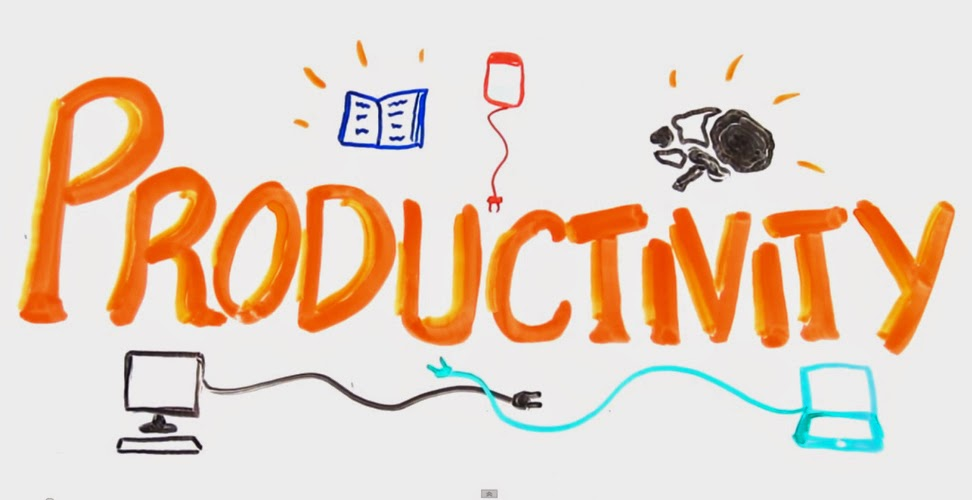

Recently, I have completed 6 years in IT industry. On this occasion, when I pulled my friends for a evening coffee,I have been asked by few of my friends to put down a few points that I think are worth noting from my 6 years of IT industry experience.  
Though my complete career has been with IT so far, yet I believe that the points that I would write will stand valid for all the other fields where effort and output has a great importance. Hence, I published my article in LinkedIn yesterday with just 4 and yet most important according to me.

As a child, I was taught that I must have some *self-guidelines* and *self-discipline*. However, it is a surprising thing that the so called “self” are taught to me when I was a kid, and I was made to keep up to the mark and if there is any chance, make it a habit for lifetime.

The common point from one of the many “*self*” things that were taught at home and school was being able to do and complete my activities in time and within the schedule of either my parents (mostly my mom in this case) or by my teachers.  All of them believed that doing so will take us to a better tomorrow and a better way of leading life.

Here are my 4 most important learning’s that I had in my last 6 years as a professional in an IT industry that is mostly dominated with the single phrase – “***productivity***”.

  

\[Read the complete article here: [Read It Now!!!](https://www.linkedin.com/today/post/article/20140703201107-78853246-4-points-for-better-productivity-and-for-a-better-product?trk=object-title)\]

  

pic credits: **xlntele**

### Manage your tasks and not your time

I prefer saying manage one’s tasks over managing one’s time. Managing one’s activities is more important than managing time. Doesn’t it sound funny when someone says – “You will have to learn to manage your time”? \[[Read more](https://www.linkedin.com/today/post/article/20140703201107-78853246-4-points-for-better-productivity-and-for-a-better-product?trk=object-title)\].

### Understand the key concepts/ business scenario.

No matter what field you are in, it is more important to understand the true business scenario to which you are working. This means, think what is it that the end user (customer) is expecting when she comes across your product. Does your design appeal the end user? Does your approach have all the ingredients that will keep up to the expectations of the end user? \[[Read more](https://www.linkedin.com/today/post/article/20140703201107-78853246-4-points-for-better-productivity-and-for-a-better-product?trk=object-title)\].

### Get involved and get going.

Don’t stop after you know what the end user has asked you for. Be proactive. Talk to your manager. Get involved in all those meetings and interactions that have the client representation. \[[Read more](https://www.linkedin.com/today/post/article/20140703201107-78853246-4-points-for-better-productivity-and-for-a-better-product?trk=object-title)\]!

### Communicate and communicate directly.

I am sure that majority of the sessions that you were forced into might just have been on communication skills and email communication. I am confident that they have definitely helped you better the way you talk to your colleagues and the way you write your emails.

However, what I mean here is completely different from the rest of them \[[Read more](https://www.linkedin.com/today/post/article/20140703201107-78853246-4-points-for-better-productivity-and-for-a-better-product?trk=object-title)\].
