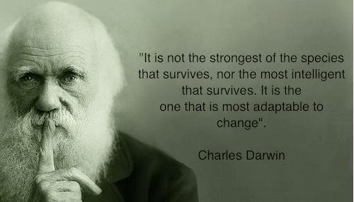

In one of my appraisal cycles, it was time for feedback from my manager. He asked me

"Prasad, do you have any questions? So that I will answer them before we proceed to the feedback"

I said "Yes" and I continued with my question. It was like this.

"What do you think is the biggest trait that one should carry to be successful even if he/she fails sometime in their life?"

I had put the question without any pauses. My manager took a deep breath, smiled at me and he started off.

He questioned me. "Do you get depressed if you fail?"

I answered him promptly with a "NO" and added that "I will think about what were those factors that made me fail."

He smiled again and said "Then, you have the eligibility to ask this question." and he continued. "It's a very strong question that has to be visited very day and you should make it a habit to think about this question every day to push your limits beyond your capacity."

and he warned me " and its not that easy." "Prasad, everyone who knows how to use a computer can write some piece of code. Even if it is a junk and not a penny worth. He/she can still Google up and write the code, yet all that it takes to make something work and work in a desired way is the ability to adapt."

"There are many institutes that teach technical things. There are many websites that give you line by line example on how to use a library or a dll, yet it is your inbuilt or your learned skill from your experience that makes you stand apart from the rest."

"All that you need to be successful is to be adaptable to the situation. Question what is it that the user of the application that you are building is looking for. Put your mind and question yourself, what if you are the user of the application. Is it easy for you to use it? Is it helping you to finish your work at ease or is it costing you more time?"

"You should be like a solider on the filed. getting adapted to every situation and coming out of that with thought to success"

After this, he said we are done with this meet. There was no feedback session that day. I could read my manager's eyes. They were filled with happiness and he was feeling so much excited about this fruitful topic.

Image:http://media-cache-ak0.pinimg.com/236x/45/ac/ba/45acbacaeee71649d58de840a7d73e7e.jpg
