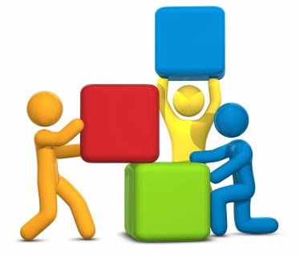

During few Coffee time breaks in the last 2 weeks, we a group of 4-5 people have been discussing about Agile and one of my friend asked me -

  

**what is that ONE THING, that is SO GOOD with AGILE that can made this methodology happen and work for so many.**

 As always it was, we did have one of our friend supporting waterfall model.

 

*image belongs to the respective owner*

  

  

### Here is (are?) my answer(s) :

  

 ü  Agile is all about developing a part of the application in iterative cycles (sprints). 

ü  At the end of the sprint, a minimal deliverable product that is part of the actual application is delivered. This means, a team or an individual is not dealing with too many things at a time.

  

ü  When it comes to the manager’s point of view, it means that he or she can see what is going good or what's going bad with the development strategy is. 

  

ü  When it comes to the owners of the product i.e., the  higher management, it gives them an opportunity to look at how the current application is, assess against the odds on how it’s going to fare.

  

ü  Show it to the stakeholders or potential customers and get the feedback from them and work again on the application to do what matters the most to the end user.

  

In contrast, Waterfall is all about collecting all the requirements and executing them over a long period of time and then delivering them. You never know, when the priority of the consumers is going to change.
