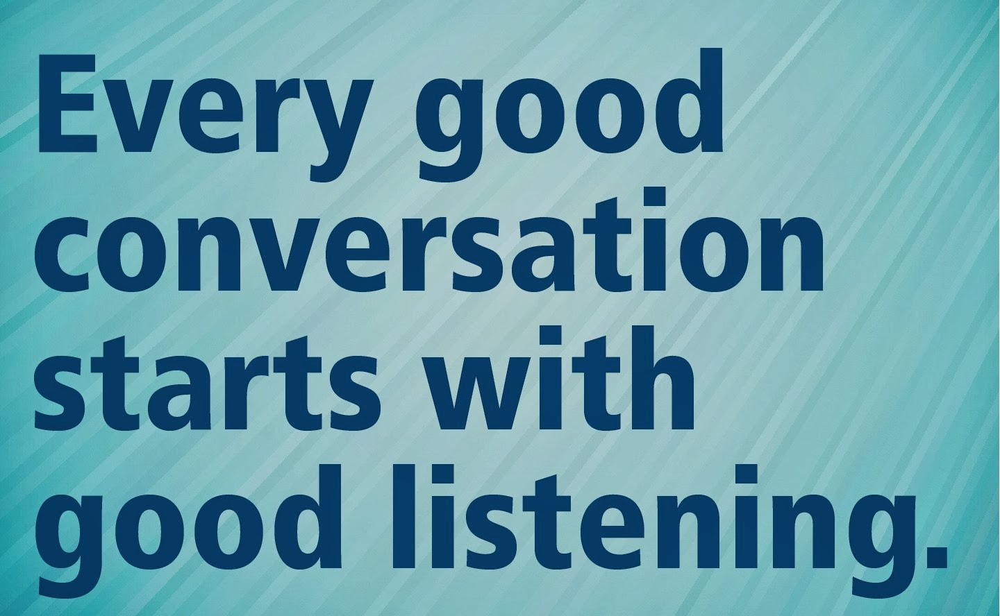

I think it’s not just right to talk about code and the software practices alone. There is more to this what makes the earlier two things go on and succeed. They are skills of different kind. I know that you guys would have guessed it by now – the behavior skills.

  

Behavior skills in its own is a very vast subject and more importantly it cannot be taught with a chapter in the book for every situation. However, we can make ourselves go through few leanings and stitch them with our previous experience and make ourselves ready for the best and the worst. And every time, it’s the act as per the situation that makes us more convenient and others in the situation more comfortable. So, let’s jump in, but where shall we start? I have the answer!!! Trust me and follow me here.

  

  

The first and the foremost of the Behavior skills (BS) is conversing. I somehow don’t want to take the word **communication** right away and right here, because it’s again a big topic on its own. When we are at a comfortable place, we will start using the word **communication**. Conversing is between two or more people and in general on a specific topic. So as far as the subject is concerned it’s easy for everyone in the group. However, for the subject to take a route where it realizes (*I dislike the word ends-up, because it’s like a narrow mind thought*)to become a fruitful discussion is when everyone puts in their thoughts on the subject matter.

  

But what it takes to make everyone their thought? It’s all about a simple practice of listening to the one who is talking/speaking and the rest giving the full levels of dedication to the one talking. This makes the complete circle of conversing. Yes, A complete life cycle of conversation (*sounds pretty similar to SDLC?).*

  

So, we shall put a full stop for this point here and come back with a new line in the next post. Thus, **it’s very important that we listen to someone who is talking in the group while we are in discussing, because you might never know that a person who hasn’t spoke at all has a better idea** than the rest of the team. See you soon!
