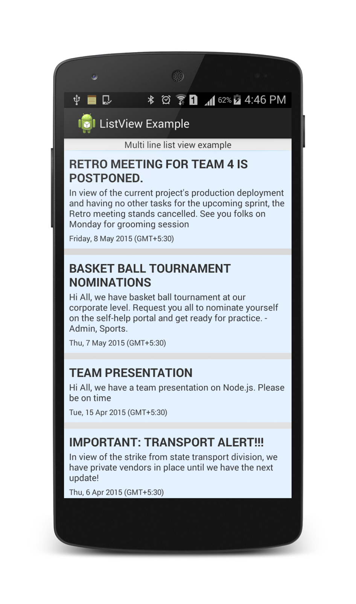

Recently we had a requirement where we have to display data in a list in android. Every row in the list has multiple TextView items. It means, we wanted an output that is like this!



  
Requirement:

-   The list items should have space division between them.
-   The default color of the listview item must be colored in gray+blue mix.
-   On touch/click of the item, it should highlight it as green.
-   Every item in the list has 3 elements (Header, content/information and datetime when the content was received)

  

**So, how did I do it?**

-   To achieve the colors needed for the project, that is default -gray and on hover - green, we did this

**Add**: Inside res/drawable, create a new resource file with the following name ***generic\_list\_row\_selector.xml***

Add the following code to it.

```html
<?xml version="1.0" encoding="utf-8"?>
<selector xmlns:android="http://schemas.android.com/apk/res/android">
    <item
        android:state_selected="false"
        android:state_pressed="false"
        android:drawable="@drawable/gradient_background" />
    <item android:state_pressed="true"
        android:drawable="@drawable/gradient_background_hover" />
    <item android:state_selected="true"
        android:state_pressed="false"
        android:drawable="@drawable/gradient_background_hover" />
</selector>
```

  

  

2nd, **Add**: ***gradient\_background.xml*** which has the below code  

```html
<?xml version="1.0" encoding="utf-8"?>
<selector xmlns:android="http://schemas.android.com/apk/res/android">
<item
    android:state_selected="false"
    android:state_pressed="false"
    android:drawable="@drawable/gradient_background" />
<item android:state_pressed="true"
    android:drawable="@drawable/gradient_background_hover" />
<item android:state_selected="true"
    android:state_pressed="false"
    android:drawable="@drawable/gradient_background_hover" />
</selector>
```

3rd, **Add *gradient\_background\_hover.xml*** with the below code snippet in it

-   Open the main activity file's designer -> in my case it is MainActivity and its related designer calss is acitivity\_main

Add the following code to it. This has the ListView that will show the list of items that we bind

  

```html
<?xml version="1.0" encoding="utf-8"?>
<LinearLayout xmlns:android="http://schemas.android.com/apk/res/android"
    android:layout_width="fill_parent"
    android:layout_height="fill_parent"
    android:orientation="vertical" >

    <TextView
        android:layout_width="fill_parent"
        android:layout_height="wrap_content"
        android:gravity="center_vertical|center_horizontal"
        android:text="Multi line list view example" />

    <ListView
        android:id="@+id/lstView_ShowView"
        android:layout_width="fill_parent"
        android:dividerHeight="10dp"
        android:layout_height="fill_parent" />

</LinearLayout>
```

  

-   Now we need the Row that has the TextView elements that displays the data for us. Create a new res file named **activity\_custom\_row\_for\_listview.xml** with the following code in it.

```html
<?xml version="1.0" encoding="utf-8"?>
<RelativeLayout xmlns:android="http://schemas.android.com/apk/res/android"
    android:layout_width="fill_parent"
    android:layout_height="wrap_content"
    android:background="@drawable/generic_list_row_selector"
    android:padding="8dp" >

    <TextView
        android:id="@+id/lblRowTitle"
        android:layout_width="wrap_content"
        android:layout_height="wrap_content"
        android:textSize="@dimen/title"
        android:textStyle="bold"
        android:textAllCaps="true"
        android:text="I AM A TITLE IN CAPS. I AM A TITLE IN CAPS. I AM A TITLE IN CAPS."/>

    <TextView
        android:id="@+id/lblRowContent"
        android:layout_width="fill_parent"
        android:layout_height="wrap_content"
        android:layout_below="@id/lblRowTitle"
        android:layout_marginTop="1dip"
        android:textSize="@dimen/content"
        android:text="@string/row_sample_content"/>

    <TextView
        android:id="@+id/lblRowDateTime"
        android:layout_width="fill_parent"
        android:layout_height="wrap_content"
        android:layout_below="@id/lblRowContent"
        android:layout_marginTop="5dp"
        android:textSize="@dimen/datetime"
        android:text="Saturday, 9 May 2015 (GMT+5:30)"/>

</RelativeLayout>
```

  

The data that will be bind to the controls - TextView will be from an object holder. So, create a java class named **DisplayDataClass.java**

```java
package com.eshwarlistviewsample.eshwarlistviewsample.listviewexample;

/**
 * Created by Admin on 09-05-2015.
 */
public class DisplayDataClass {
    private String ReceivedTitle;
    private String ReceivedContent;
    private String ReceivedDateTime;

    public String getReceivedTitle() {
        return ReceivedTitle;
    }

    public void setReceivedTitle(String receivedTitle) {
        ReceivedTitle = receivedTitle;
    }

    public String getReceivedContent() {
        return ReceivedContent;
    }

    public void setReceivedContent(String receivedContent) {
        ReceivedContent = receivedContent;
    }

    public String getReceivedDateTime() {
        return ReceivedDateTime;
    }

    public void setReceivedDateTime(String receivedDateTime) {
        ReceivedDateTime = receivedDateTime;
    }
}
```

  

Now, create a custom Adaptor, that will make sure to bind the controls with the data as the data is fed in and rebinds it with each item (row) of the listview. Create a file named **CustomAdaptor.java**

```java
package com.eshwarlistviewsample.eshwarlistviewsample.listviewexample;

import android.content.Context;
import android.view.LayoutInflater;
import android.view.View;
import android.view.ViewGroup;
import android.widget.BaseAdapter;
import android.widget.TextView;

import java.util.ArrayList;

/**
 * Created by Admin on 09-05-2015.
 */
public class CustomAdaptor extends BaseAdapter {

    private static ArrayList<DisplayDataClass> dataClassArrayList;
    private LayoutInflater mInflater;

    public CustomAdaptor(Context context, ArrayList<DisplayDataClass> results) {
        dataClassArrayList = results;
        mInflater = LayoutInflater.from(context);
    }

    @Override
    public int getCount() {
        return dataClassArrayList.size();
    }

    @Override
    public Object getItem(int position) {
        return dataClassArrayList.get(position);
    }

    @Override
    public long getItemId(int position) {
        return position;
    }

    @Override
    public View getView(int position, View convertView, ViewGroup viewGroup) {
        ViewHolder holder;
        if (convertView == null) {
            convertView = mInflater.inflate(R.layout.activity_custom_row_for_list_view, null);
            holder = new ViewHolder();
            holder.txtTitle = (TextView) convertView.findViewById(R.id.lblRowTitle);
            holder.txtContent = (TextView) convertView
                    .findViewById(R.id.lblRowContent);
            holder.txtDateTime = (TextView) convertView.findViewById(R.id.lblRowDateTime);

            convertView.setTag(holder);
        } else {
            holder = (ViewHolder) convertView.getTag();
        }

        holder.txtTitle.setText(dataClassArrayList.get(position).getReceivedTitle());
        holder.txtContent.setText(dataClassArrayList.get(position)
                .getReceivedContent());
        holder.txtDateTime.setText(dataClassArrayList.get(position).getReceivedDateTime());

        return convertView;
    }
    static class ViewHolder {
        TextView txtTitle;
        TextView txtContent;
        TextView txtDateTime;
    }
}
```

  

**C**omeback to the parent class now. It should have the below code  

```java
package com.eshwarlistviewsample.eshwarlistviewsample.listviewexample;

import android.app.Activity;
import android.os.Bundle;
import android.view.Menu;
import android.view.MenuItem;
import android.view.View;
import android.widget.AdapterView;
import android.widget.ListView;
import android.widget.TextView;
import android.widget.Toast;

import java.util.ArrayList;

public class MyActivity extends Activity {

    @Override
    protected void onCreate(Bundle savedInstanceState) {
        super.onCreate(savedInstanceState);
        setContentView(R.layout.activity_my);

        ArrayList<DisplayDataClass> getDisplayDataSample = GetDisplayResults();

        final ListView lv = (ListView) findViewById(R.id.lstView_ShowView);
        lv.setAdapter(new CustomAdaptor(this, getDisplayDataSample));

        lv.setOnItemClickListener(new AdapterView.OnItemClickListener() {
            @Override
            public void onItemClick(AdapterView<?> a, View view, int position, long id) {
                Object receivedObject = lv.getItemAtPosition(position);
                String clickedLblRowDateTime = ((TextView)view.findViewById(R.id.lblRowDateTime)).getText().toString();
                Toast.makeText(getApplicationContext(),
                        "Topic occurrence on:  " + clickedLblRowDateTime.toString(),
                        Toast.LENGTH_LONG).show();
            }
        });
    }
    private ArrayList<DisplayDataClass> GetDisplayResults(){
        ArrayList<DisplayDataClass> results = new ArrayList<DisplayDataClass>();

        DisplayDataClass dc = new DisplayDataClass();
        dc.setReceivedTitle("Retro meeting for team 4 is postponed.");
        dc.setReceivedContent("In view of the current project's production deployment and having no other tasks for the upcoming sprint, the Retro meeting stands cancelled. See you folks on Monday for grooming session");
        dc.setReceivedDateTime("Friday, 8 May 2015 (GMT+5:30)");
        results.add(dc);

        dc = new DisplayDataClass();
        dc.setReceivedTitle("Basket ball tournament nominations");
        dc.setReceivedContent("Hi All, we have basket ball tournament at our corporate level. Request you all to nominate yourself on the self-help portal and get ready for practice. - Admin, Sports.");
        dc.setReceivedDateTime("Thu, 7 May 2015 (GMT+5:30)");
        results.add(dc);

        dc = new DisplayDataClass();
        dc.setReceivedTitle("Team presentation");
        dc.setReceivedContent("Hi All, we have a team presentation on Node.js. Please be on time");
        dc.setReceivedDateTime("Tue, 15 Apr 2015 (GMT+5:30)");
        results.add(dc);

        dc = new DisplayDataClass();
        dc.setReceivedTitle("Important: Transport Alert!!!");
        dc.setReceivedContent("In view of the strike from state transport division, we have private vendors in place until we have the next update!");
        dc.setReceivedDateTime("Thu, 6 Apr 2015 (GMT+5:30)");
        results.add(dc);

        dc = new DisplayDataClass();
        dc.setReceivedTitle("Internal Cricket tournament");
        dc.setReceivedContent("Nominations for internal cricket tournament have been closed now! Will update you all soon!");
        dc.setReceivedDateTime("Friday, 1 Apr 2015 (GMT+5:30)");
        results.add(dc);

        dc = new DisplayDataClass();
        dc.setReceivedTitle("Meeting rooms blocked");
        dc.setReceivedContent("All meeting rooms in floor-5 are closed for cleaning until today evening.");
        dc.setReceivedDateTime("Friday, 1 Apr 2015 (GMT+5:30)");
        results.add(dc);

        dc = new DisplayDataClass();
        dc.setReceivedTitle("Retro meeting for team 4 is postponed.");
        dc.setReceivedContent("In view of the current project's production deployment and having no other tasks for the upcoming sprint, the Retro meeting stands cancelled. See you folks on Monday for grooming session");
        dc.setReceivedDateTime("Friday, 8 May 2015 (GMT+5:30)");
        results.add(dc);

        dc = new DisplayDataClass();
        dc.setReceivedTitle("Basket ball tournament nominations");
        dc.setReceivedContent("Hi All, we have basket ball tournament at our corporate level. Request you all to nominate yourself on the self-help portal and get ready for practice. - Admin, Sports.");
        dc.setReceivedDateTime("Thu, 7 May 2015 (GMT+5:30)");
        results.add(dc);

        dc = new DisplayDataClass();
        dc.setReceivedTitle("Team presentation");
        dc.setReceivedContent("Hi All, we have a team presentation on Node.js. Please be on time");
        dc.setReceivedDateTime("Tue, 15 Apr 2015 (GMT+5:30)");
        results.add(dc);

        dc = new DisplayDataClass();
        dc.setReceivedTitle("Important: Transport Alert!!!");
        dc.setReceivedContent("In view of the strike from state transport division, we have private vendors in place until we have the next update!");
        dc.setReceivedDateTime("Thu, 6 Apr 2015 (GMT+5:30)");
        results.add(dc);

        dc = new DisplayDataClass();
        dc.setReceivedTitle("Retro meeting for team 4 is postponed.");
        dc.setReceivedContent("In view of the current project's production deployment and having no other tasks for the upcoming sprint, the Retro meeting stands cancelled. See you folks on Monday for grooming session");
        dc.setReceivedDateTime("Friday, 8 May 2015 (GMT+5:30)");
        results.add(dc);

        dc = new DisplayDataClass();
        dc.setReceivedTitle("Basket ball tournament nominations");
        dc.setReceivedContent("Hi All, we have basket ball tournament at our corporate level. Request you all to nominate yourself on the self-help portal and get ready for practice. - Admin, Sports.");
        dc.setReceivedDateTime("Thu, 7 May 2015 (GMT+5:30)");
        results.add(dc);

        return results;
    }

    @Override
    public boolean onCreateOptionsMenu(Menu menu) {
        // Inflate the menu; this adds items to the action bar if it is present.
        getMenuInflater().inflate(R.menu.my, menu);
        return true;
    }

    @Override
    public boolean onOptionsItemSelected(MenuItem item) {
        // Handle action bar item clicks here. The action bar will
        // automatically handle clicks on the Home/Up button, so long
        // as you specify a parent activity in AndroidManifest.xml.
        int id = item.getItemId();
        if (id == R.id.action_settings) {
            return true;
        }
        return super.onOptionsItemSelected(item);
    }
}
```

  
The method private ArrayList<DisplayDataClass> GetDisplayResults() inside the class MainActivity is the data object. You can plug in your own data and show it here. It might be from SQLite database or from an API or from GCM or from another Activity inside your android app. 

  

Hope, you have liked my tutorial. Stay tuned! there is a lot to come. - Eshwar
