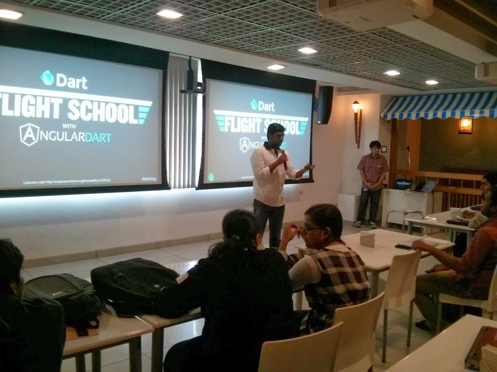
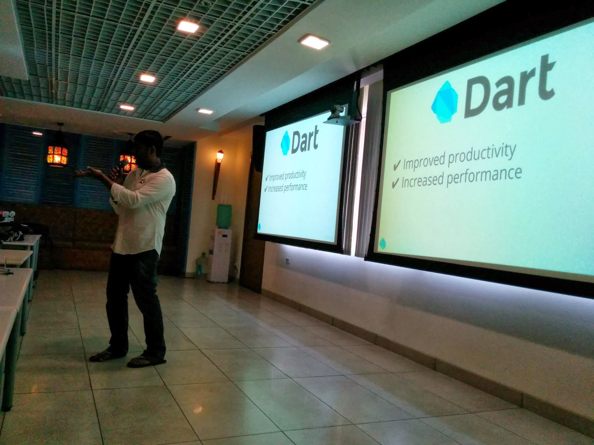
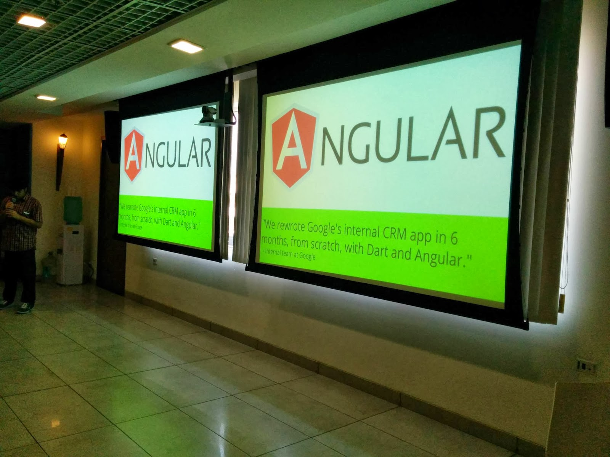
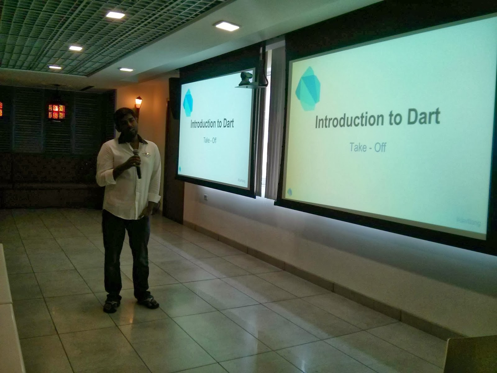
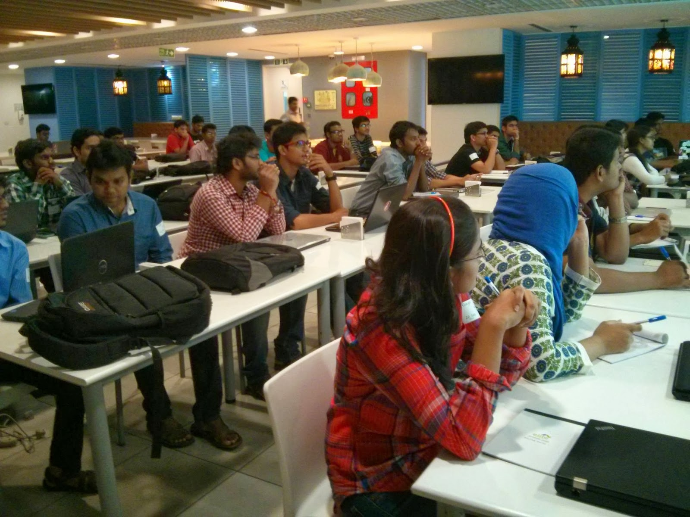
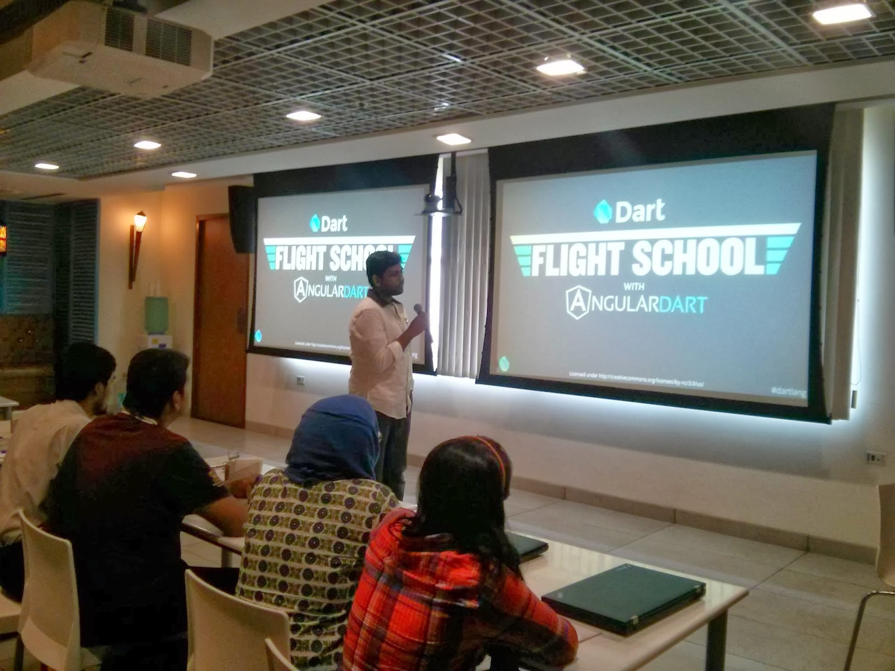
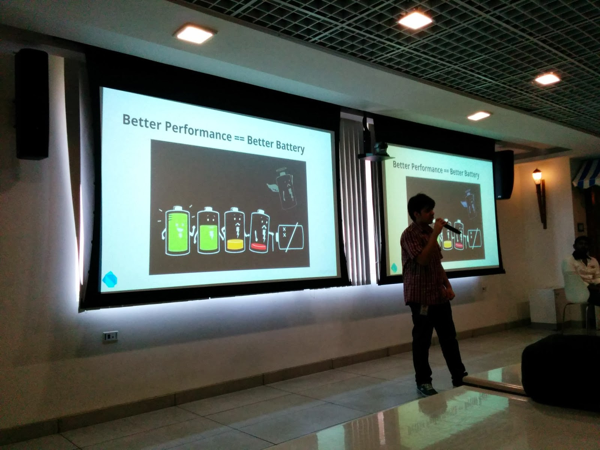

I have attended the Angular Dart session called the FLIGHT SCHOOL in the Google Hyderabad over the weekend on 22/2/2014 organized by Google Developer Group - Hyderabad (#GDGHyd). Dart is a programming language from Google that's built on Object Oriented Programming and is an open source. 

So what? We have a post on it's way that teaches the basics of DART. 

Below are the few snaps from the event.

\-

\-

  

  

  

  

