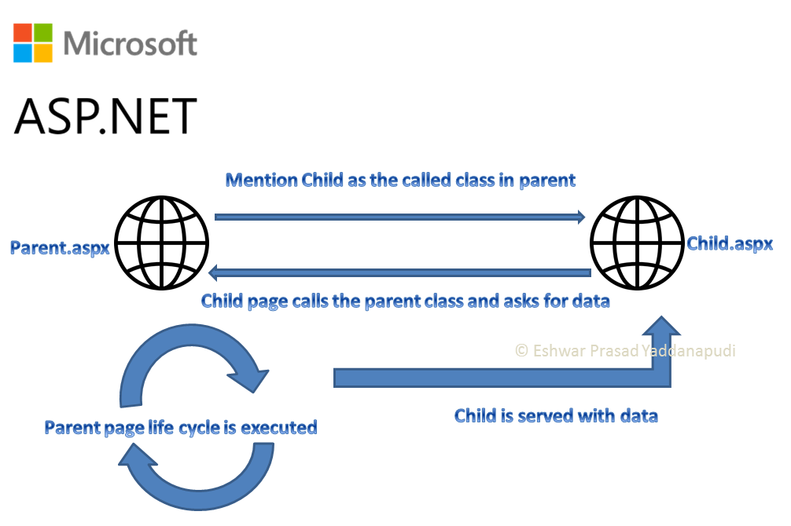

## **cross page posting**

Cross page posting is a type of session management in which the values of Page1 are sent to Page2 using PostbackUrl attribute of the event driven items in an ASP.NET page. The event driven items in a page can be anything like a button or a link click. Instead of a event handler inside the aspx.cs file, the page takes the properties from Page1 to Page2 using the post function.

  

Sample Code is here

Create a page called CrossPostingParent.aspx

Let it have 2 textboxes that takes name and age and submits the data to another page CrossPostingChild.aspx using a button that has PostBackUrl set.

  

Corss Page Posting is a response.redirect action. So the browser shows a change in address.

  

CrossPostingParent.aspx

```asp
<%@ Page Language="C#" AutoEventWireup="true" CodeBehind="CrossPostingParent.aspx.cs" Inherits="SessionManagement01.CrossPostingParent" %>

<!DOCTYPE html>

<html xmlns="http://www.w3.org/1999/xhtml">
<head runat="server">
    <title></title>
</head>
<body>
    <form id="form1" runat="server">
    <div>
    <asp:TextBox runat="server" ID="_nameText" />
     <asp:TextBox runat="server" ID="_ageText" />
     <asp:Button runat="server" ID="btnSubmit" Text="Submit" PostBackUrl="~/CrossPostingChild.aspx" />
    </div>
    </form>
</body>
</html>
```

  



CrossPostingChild.aspx

```asp
<%@ Page Language="C#" AutoEventWireup="true" CodeBehind="CrossPostingChild.aspx.cs" Inherits="SessionManagement01.CrossPostingChild" %>

<!DOCTYPE html>

<html xmlns="http://www.w3.org/1999/xhtml">
<head runat="server">
    <title></title>
</head>
<body>
    <form id="form1" runat="server">
    <div>
    <asp:Label runat="server" ID="_dataText" />
    </div>
    </form>
</body>
</html>
```

inside the CrossPostingChild.aspx.cs file

```csharp
using System;
using System.Collections.Generic;
using System.Linq;
using System.Web;
using System.Web.UI;
using System.Web.UI.WebControls;

namespace SessionManagement01
{
    public partial class CrossPostingChild : System.Web.UI.Page
    {
        protected void Page_Load(object sender, EventArgs e)
        {
            //scenario 1
            if (Request["_nameText"] != null)
                _dataText.Text = Request["_nameText"];
            _dataText.Text += " is ";
            if (Request["_ageText"] != null)
                _dataText.Text += Request["_ageText"];
            _dataText.Text += " years old";
        }
    }
}
```

  
This is not the only way where the data can be sent to another page using cross page posting. ASP.NET gives us a better option using the strongly typed way. In this case, we need to decorate our child class with @PrivousPage page directive and set its virtualPath property to parent page. This means that whenever there is a cross page posting it will only happen via the page defined in VirtualPath.  
Apart from this, define public properties in parent class that can be used in the child class via the .PreviousPage property.The complete code is as below. I have commented the code for scenario one so that you will have a better understanding  

```asp
<%@ Page Language="C#" AutoEventWireup="true" CodeBehind="CrossPostingChild.aspx.cs" Inherits="SessionManagement01.CrossPostingChild" %>
<%@ PreviousPageType  VirtualPath="~/CrossPostingParent.aspx" %>
<!DOCTYPE html>

<html xmlns="http://www.w3.org/1999/xhtml">
<head runat="server">
    <title></title>
</head>
<body>
    <form id="form1" runat="server">
    <div>
    <asp:Label runat="server" ID="_dataText" />
    </div>
    </form>
</body>
</html>
```

```csharp title="Inside the C# file of child class"
using System;
using System.Collections.Generic;
using System.Linq;
using System.Web;
using System.Web.UI;
using System.Web.UI.WebControls;

namespace SessionManagement01
{
    public partial class CrossPostingChild : System.Web.UI.Page
    {
        protected void Page_Load(object sender, EventArgs e)
        {
            string name=string.Empty;
            int age = -1;
            //scenario 1
            //if (Request["_nameText"] != null)
            //    _dataText.Text = Request["_nameText"];
            //_dataText.Text += " is ";
            //if (Request["_ageText"] != null)
            //    _dataText.Text += Request["_ageText"];
            //_dataText.Text += " years old";

            // Strongly typed way
            age = this.PreviousPage.Age;
            name = this.PreviousPage.Name;
            _dataText.Text = string.Format("Hello,{0} you are {1} years old!", name, age);
        }
    }
}
```

```csharp title="Modified parent C# class file."
using System;
using System.Collections.Generic;
using System.Linq;
using System.Web;
using System.Web.UI;
using System.Web.UI.WebControls;

namespace SessionManagement01
{
    public partial class CrossPostingParent : System.Web.UI.Page
    {
        // used in passing properties as readonly in a strongly typed cross page posting
        public string Name { get { return _nameText.Text; } }
        // used in passing properties as readonly in a strongly typed cross page posting
        public int Age { get { return int.Parse(_ageText.Text); } }
        //nothing on the Page load event and no handlers to make transition
        protected void Page_Load(object sender, EventArgs e)
        {

        }

    }
}
```
