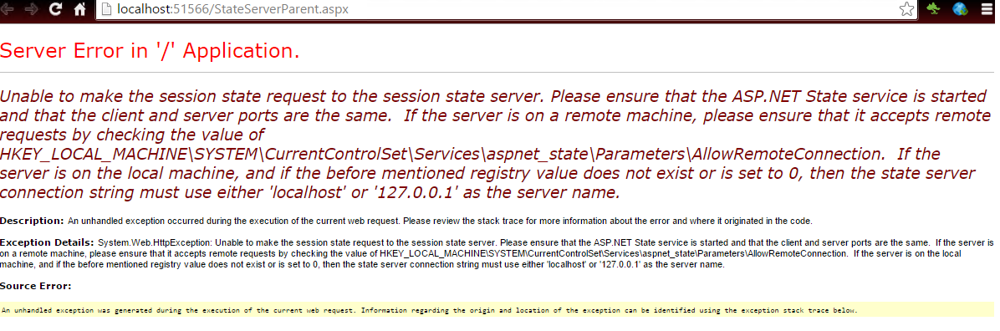
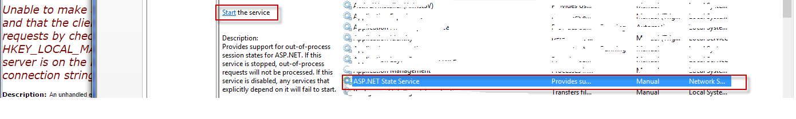

ASP.NET session management in StateServer Mode.  
StateServer is a session management technique in which the data is stored in the ASP.NET stateserver service that runs on your machine. This is part of the Out-of-Process (OutProc) modes in which ASP.NET session data can be stored.

Now, let us see how we can do this.

-   create a start page called StateServerParent.aspx.
-   create another page named StateServerChild.aspx. This is the page that shows the data from parent page that are stored in stateserver mode of the session.
-   In Web.Config file that is at the root of your application, add the following code in section.

```html
<sessionState mode="StateServer" stateConnectionString="tcpip=127.0.0.1:42424"/>
```

C# code behind for parent file where the data is stored in session.  

```csharp
using System;
using System.Collections.Generic;
using System.Linq;
using System.Web;
using System.Web.UI;
using System.Web.UI.WebControls;

namespace SessionManagementSamples
{
    public partial class StateServerParent : System.Web.UI.Page
    {
        protected void Page_Load(object sender, EventArgs e)
        {

        }

        protected void Submit_Click(object sender, EventArgs e)
        {
            Session["name"] = _nameText.Text;
            Session["Age"] = _ageText.Text;

            Server.Transfer("StateServerChild.aspx");
        }
    }
}
```

C# code behind for child class for retrieving data from session  

```csharp
using System;
using System.Collections.Generic;
using System.Linq;
using System.Web;
using System.Web.UI;
using System.Web.UI.WebControls;

namespace SessionManagementSamples
{
    public partial class StateServerChild : System.Web.UI.Page
    {
        protected void Page_Load(object sender, EventArgs e)
        {
            _TextLabel.Text = string.Format("Hi {0}, you are {1} years old",Session["name"],Session["age"]);
        }
    }
}
```

**When you run this, the below error is thrown. This is the error. The error is self explanatory. It says that the application is looking at ASP.NET state service either on the local machine or on a remote server. If it is a local machine, then connection string should either use localhost or 127.0.0.1. The data that this error does not show is which port to look for. It is at 42424.**  



To get rid of this error and make our app up and running, goto services.msc and enable ASP.NET State Service  


