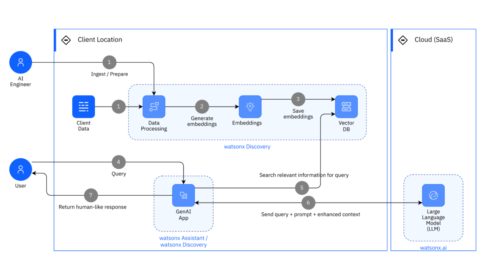
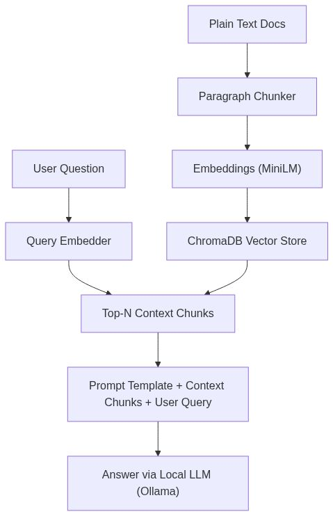

## Introduction

### What is a RAG

In the rapidly evolving world of artificial intelligence, Retrieval-Augmented Generation (RAG) has emerged as a game-changer for enhancing large language models (LLMs) with external knowledge. Traditional LLMs, while powerful, often suffer from hallucinations or outdated information because they're limited to their training data. RAG addresses this by combining retrieval mechanisms with generation, allowing models to pull relevant context from documents in real-time before generating responses.

### What are we building and where?

Enter KnowledgeAI, a GitHub repository created by me - Eshwar Prasad Yaddanapudi. This project, hosted at [RAG SINGLE DOCUMENT](https://github.com/yesprasad/rag_single_document), stands out for its minimalist approach. Unlike many RAG implementations that rely on heavy frameworks like LangChain or LlamaIndex, KnowledgeAI builds everything from scratch using basic libraries. The goal? To demystify RAG's core components—document chunking, embedding generation, vector storage, and retrieval-based prompting—while promoting transparency and customizability.

### How to get the best out of this repo?

This repository is particularly valuable for AI enthusiasts, developers, and educators who want to understand RAG "under the hood." It avoids black-box abstractions, encouraging users to write and debug their own logic. With just a few files, including a main Python script, a sample document, and detailed documentation, it serves as an educational tool for building foundational AI workflows. In this article, we'll explore the repo's contents in depth, breaking down its structure, code, and potential applications. Whether you're a beginner or an experienced engineer, KnowledgeAI offers insights into resource-efficient AI systems.

### How are the code files written

Key themes include intentional commenting in the code to build intuition, avoidance of frameworks for better understanding, and emphasis on debuggability. It's designed for those preferring hands-on learning over plug-and-play tools. The project demonstrates end-to-end thinking: from file I/O to LLM orchestration, all while maintaining efficiency.

## Overview of how the components come together

## Core Components of KnowledgeAI

Code repo: [RAG SINGLE DOCUMENT CODE REPO](https://github.com/yesprasad/rag_single_document)

### The heart

At its heart, KnowledgeAI breaks down RAG into modular steps. First, document chunking: The system processes plain text files by buffering paragraphs, detecting transitions via line breaks, and creating overlapping chunks. This overlap—appending the last two lines from previous paragraphs—ensures semantic continuity, preventing context loss at chunk boundaries.

Next, embeddings are generated using the sentence-transformers library with the 'all-MiniLM-L6-v2' model. This lightweight model converts text chunks into dense vectors, capturing meaning efficiently without high computational costs.

These embeddings are stored in a persistent vector database using ChromaDB, a local, open-source solution. ChromaDB allows for quick similarity searches, making retrieval fast and scalable for small setups.

## What's next for this project?

The current project which is a simple question and answer system is getting turned into a system that can handle multiple documents and answer queries that span across documents like - "what benefits would I get in my dental care if I upgrade from Silver to Bronze plan?" or answer queries where comparsion can be done and plan upgrade suggestions can be given based on historical treatments and expenses - ALL OF IT WITH PRIVACY and SECURITY in MIND.

**The ultimate goal of this system would be build an Agent that works 100% on Edge devices with absolute respect to privacy and security! Of course, am a long way from it, yet, this is the direction.**
