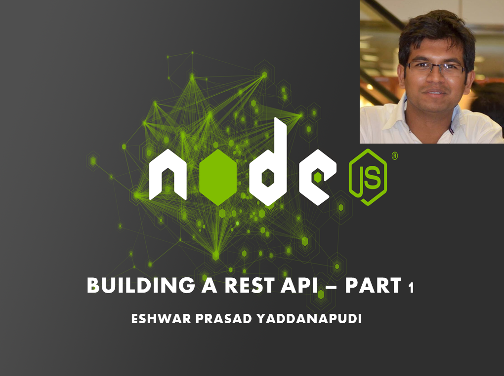

Hi friends,  
Here is the 3rd video in the series for learning Node.js and building a REST API. In this video, i give you a brief introduction to package.json file.

package.json file is the place where it holds few important information about our nodejs application. It holds the information like the dependencies, the dev-dependencies etc. So, if you install express, then the version of the express that you installed is mentioned here as a dependency.  
Watch this 11 min video. As promised, i will make sure that i dont cross 15 min of time in video length. So that each video can separately answer you a concept.

  

