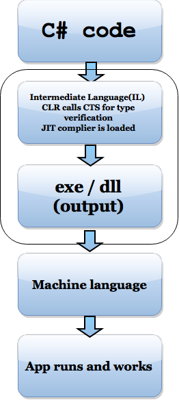

## Ever wondered how our C# code gets compiled and becomes an executable that runs on our machines?

I am sure I wrote more than a million lines of code in C# alone in my career of 7 years till date. I should have written another million lines of code in SQL Server, Android, Node.js, JavaScript and few other NO SQL languages like Mongodb, Redis and Elasticsearch.

  

Today, i was cleaning up my book shelf and found a book that i wrote sometime in 2012. That was when i was not even 4 years of experienced and the only language that i spoke apart from my mother tongue, Hindi and English was C#. In that i drew a flow chart which explained me the steps that were involved in making my C# code become an executable/ a dll that ran on my machine. I wanted to share it with you all and here it is \[ not the hand written one, of course :-) \]

  

  

