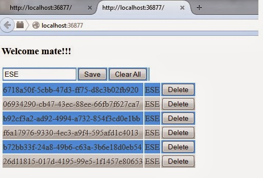

In the last 2 days, I have got my hands dirty on how to use HTML5, CSS3 and JQuery to do a simple, i mean it, very simple TODO-List using the LocalStorage of the browser.

here is what i have achieved after 2+4 hours of effort in the last 2 days. I will upload the code to Github and share the same with you folks.

trust me, JQuery is awesome with HTML5.

