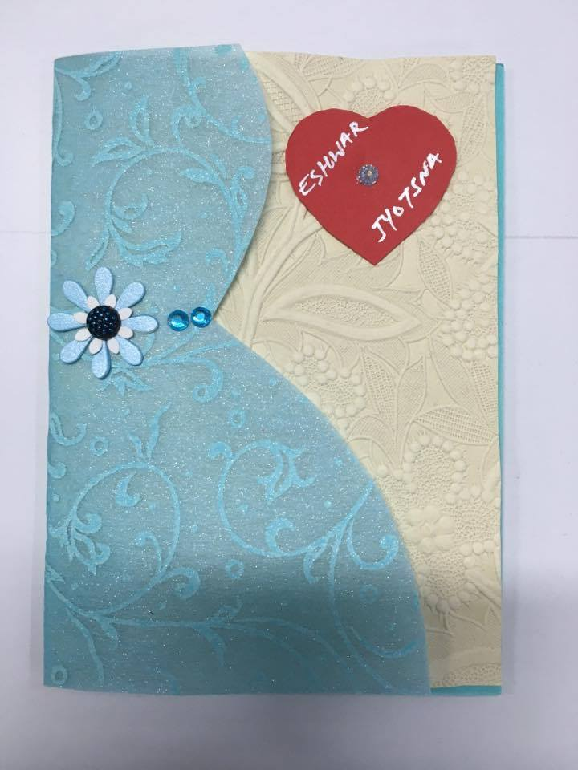
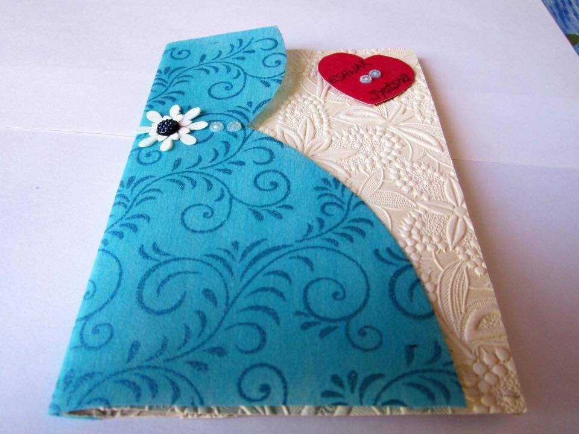
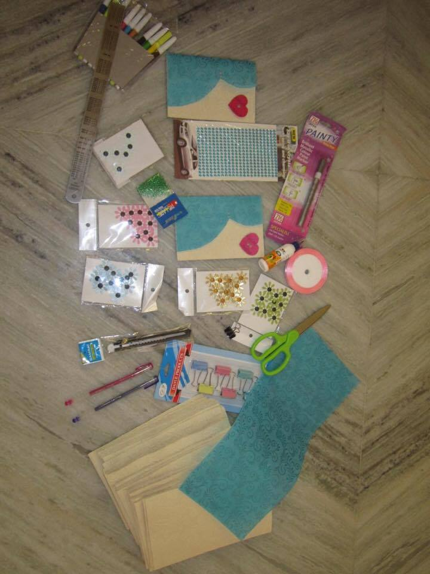
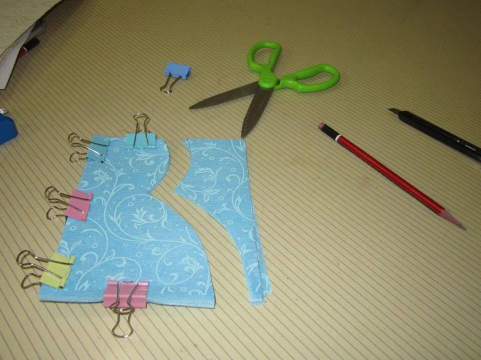
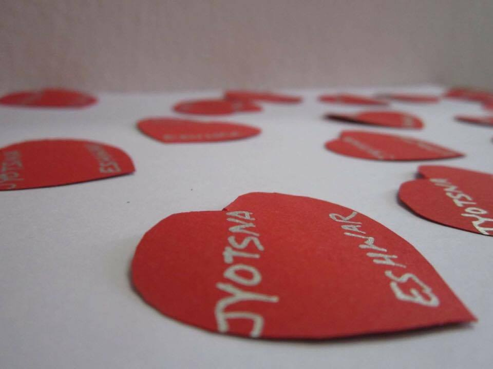
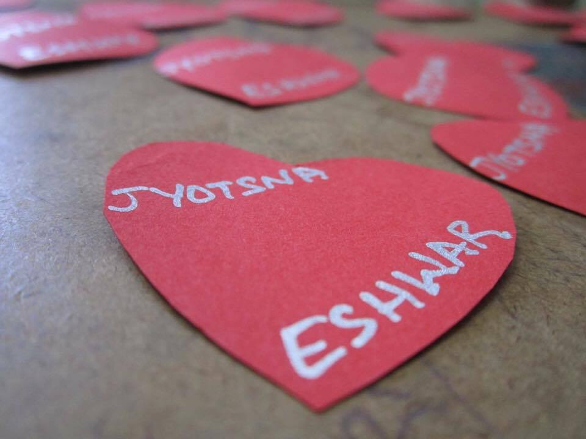
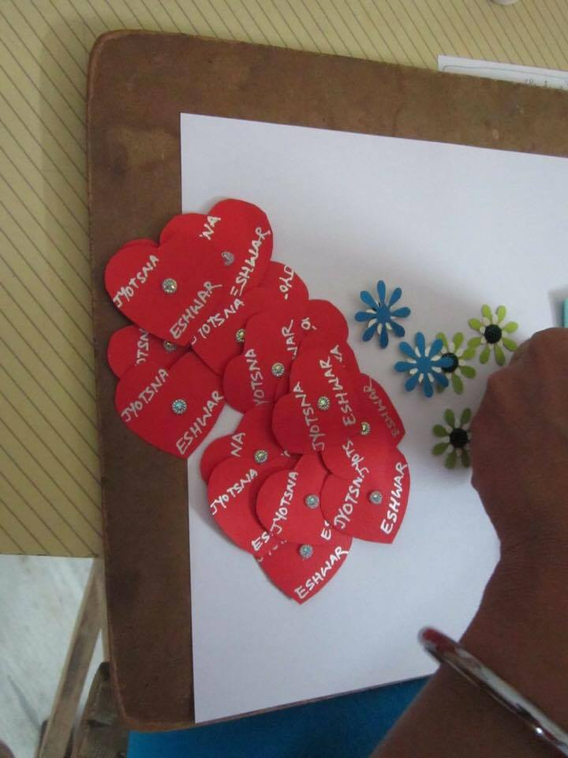
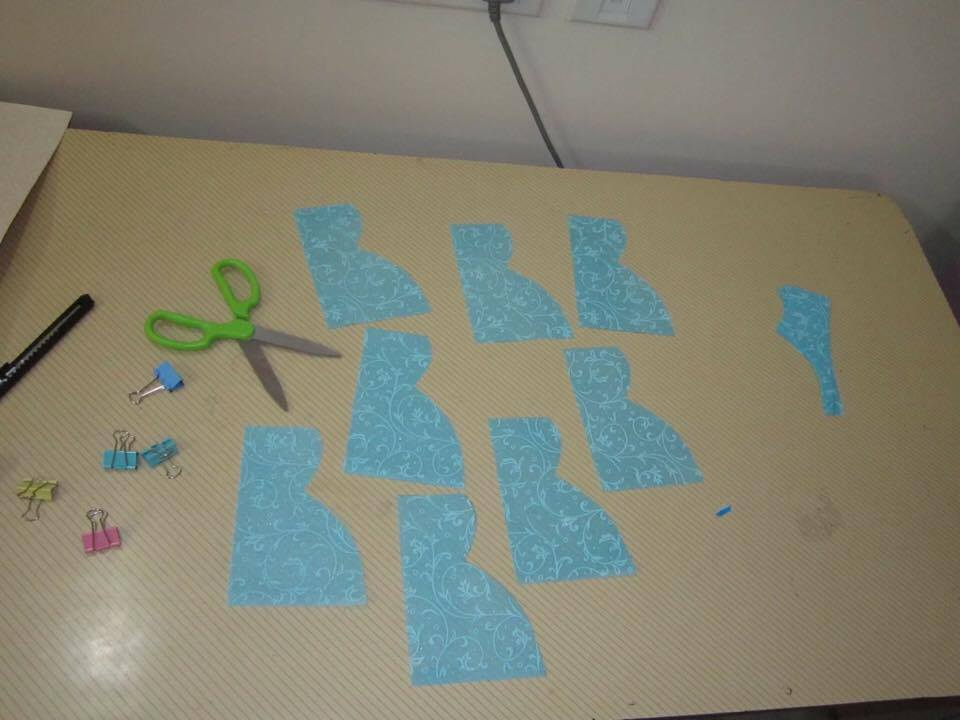
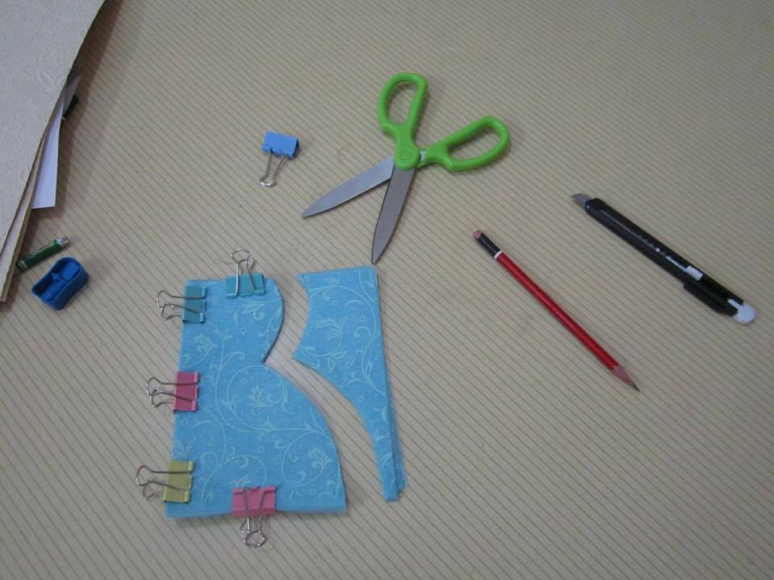
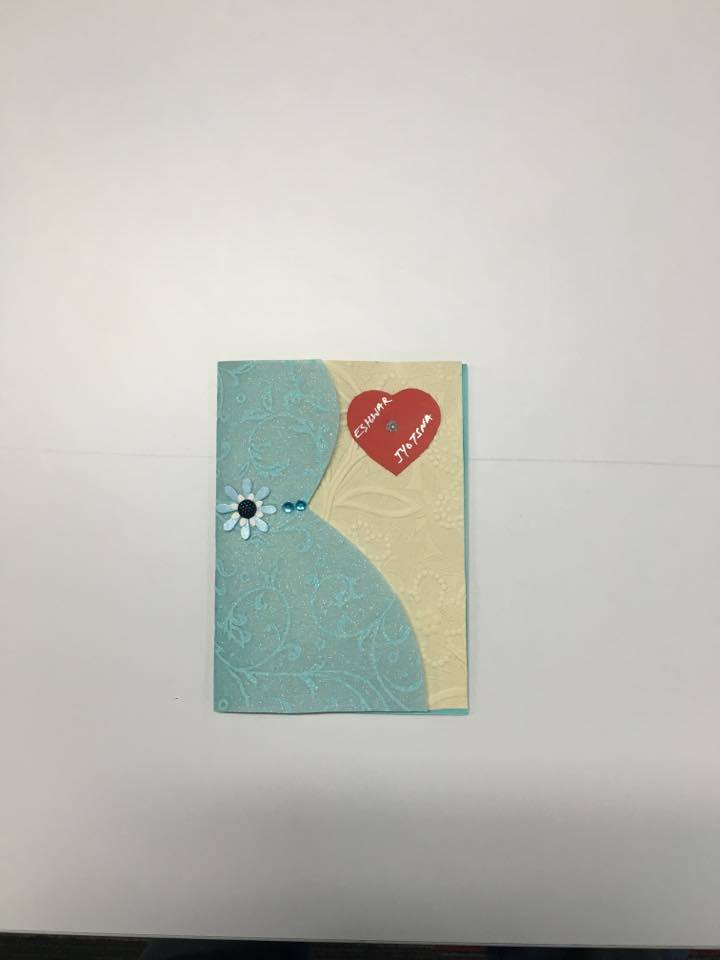

I got married this year (2016) on Feb-14 to a girl who is full of energy, grit, perseverance and passion. I believed in here for many things and of which her humble nature and family aspects are the one's that made me close to her. Apart from this, the other reason is that her home is just 6KM away from my home. 

However, this is not the point of this post. When we went out to select a personal wedding invitation for our friends, she was not quite happy with the designs. Trust me, the designs for personal wedding invitations in India have not changed in the last 5+ years. 

So, I thought, I should give her a surprise. I took help from my parents and sister, googled a bit and then designed a personal wedding invitation that she could use to invite her friends to our wedding. 

My sister and I both together have **HAND-MADE 60 WEDDING CARDS**. Here are a few pics from them.

  

  

  

  

  

  

  

  

  

  

  

  

  

  

What have I learned from this experience:

With a tight schedule of 30 days before the wedding, it was a challenge even to go search and buy an Indian Hindu wedding card. Every wedding card selling shop had close to 3000 designs for our budget. Apart from this, selecting a personal wedding card is another challenge. 

  

I have won quite a few drawing competitions and "story telling with sketches" competitions since my childhood. So, I picked up the idea to design a wedding invitation and give it as a surprise for her. 

Now, that's a fantastic idea. However, soon it became a kind of weight on my head with going to the office, coming back home and going for shopping, managing financials from my end and all of this.

  

2 days later and after a lot of searches online, I got into a belief that this is next to impossible. However, my mom encouraged me saying that this is indeed a wonderful idea and I should give it a try. 2 more days from then, I could finalize the design with the help from my mom. 

Right after this, there stood another challenge. What colors should we pick up? Where to buy the material from and how to organize all of this. I went around the city a few items before I could get the needed gloss color sheets and then proceeding to make the card 100% hand-made. 

  

**This is what I call it as perseverance and love of finishing a work that we pick in hand. Though there has been a purpose and motivation, it was not until that I decided to make it finish I could not find the right path. Always remember, right attitude and mindset is the pre-requisite for a task to get finished.**

**With just this and nothing else, I started my task and then researched, designed and developed my idea. Thank you for reading this. All the very best. Do post your comments.**
