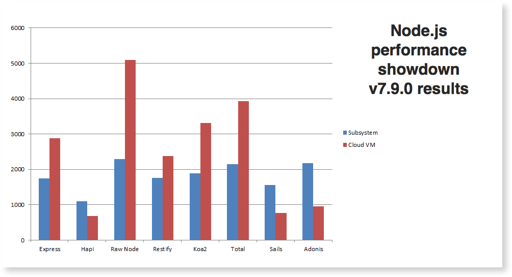

Recently, I was reading through a few node.js performance reports and articles. I then got this question - "If I start an product and decide to build its backend with node.js, which middleware will I choose and why?"

This question is like - "of course as this blog talks about, I am in love with node.js yet what if I am the CTO of a company and I sit down with my tech team to decide on the technology, how do I select a middleware for my node.js"

So, I went through few articles and here is what I found:

A [stackoverflow thread](https://stackoverflow.com/questions/17589178/why-should-i-use-restify#) where a similar question was asked where the comparison was between Express and Restify. However, it does have few more points that might be of an interest for us.

Of course the performance reports guy in the node.js framework space - [Raygun.com report for 2017](https://raygun.com/blog/nodejs-vs-hapi-express-restify-koa/).

*Image credits: Raygun.com from the above link.*

  
A few points to keep in view -  
Express does have a good concurrent requests handling mechanism and still a strong boy in the group.  
Though Koa2 takes a lead with its new overhaul version, I believe apps that are already in Express will remain loyal.  
All these benchmarks are on a simple GET ops so the results might vary and will be different from what the above chart says.

In the coming days of the upcoming week, I will publish a report for Node8 LTS and Node10. Stay tuned.
