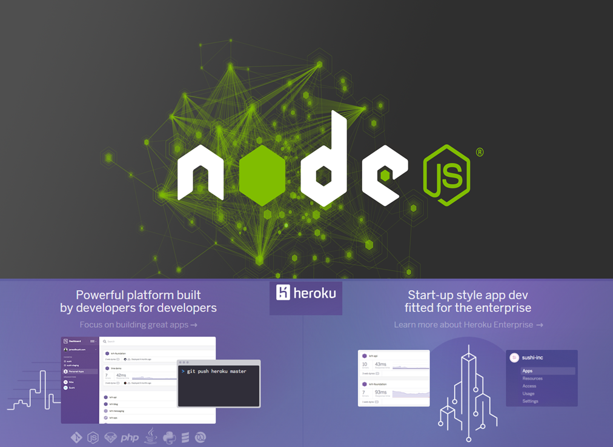

Step by step installation of Nodejs application to Heroku Cloud platform for beginner  
The Installation guide on Heroku is a bit confusing. Isn't it? So I have decided to comeup with this article on - how to deploy Nodejs application to Heroku cloud platform. This is such an important article on my blog and in my faith of sharing knowledge helps us more. This is because I have had a very tough time understanding on how Heroku works and how to push an application(Nodejs) in my case. I spent almost 2-3 days of sleepless nights apart from my working hours at office, and 3 hours of travel everyday.   
So here we go...  
Points to note, I did not address on how to create an account in Heroku or what is Heroku dashboard etc as they are basic steps and are easy to do. I have used Mongodb as my backend and I use a separate Mongo lab account and call it in my app than getting it registered inside the Heroku as an add on. The add on via Heroku is a chargeable account.  

##   
Heroku Node.js installation procedure:

**The prerequisite is that if you are using a database, say like MongoDB,**  
**i believe that you have the database as well in some database hosting environment ( use MongoLab).**   
**The post only drives you through how to make NodeJS up for Heroku.**  
  
Step 1:  
  
Inside package.json which defines the dependencies, add the below piece of code.  
"engines":{  
           "node": 0.a.b",                                                                                                         
         "npm":"0.c.d"}  
       }  
  
This will help Heroku understand what version of node and npm you want it to support  
to know the values of a,b,c,d  
  
navigate to the directory where your app folder is, in the cmd prompt  
  
C:\\MyNodeSample\\MyFirstNodeProject&gt; node version  
  
pick up the value of a. replace b with x  
  
C:\\MyNodeSample\\MyFirstNodeProject&gt; npm version  
  
pick up the value of c. replace d with x  
  
Step 2:  
Add a file named procfile with no extension to the folder that contains the files of your nodejs application  
  
Mind that p in profile is lower case alphabet.  
  
Step 3:  
Inside procfile, write the below line  
web: node server.js                                 
server.js is the starting file for my app. You can replace this with whatever file is that you have named.  
  
Step 5:  
Add a file with no name and give it the extension as gitignore. It’s as simple as this.  
  
.gitignore  
  
Step 6:  
  
Install Heroku and git on your machine from  
https://www.heroku.com/  
  
Heroku will by default install Git on your machine. Remember, git is different from GitHub.  
Git is used for versioning whereas GitHub is an online repository to hold your code.  
  
Step 7:  
Back again in the location of your app, through the cmd prompt.  
  
C:\\MyNodeSample\\MyFirstNodeProject> git init  
  
this initaillizes an empty git in your app folder.  
  
Step 8:  
C:\\MyNodeSample\\MyFirstNodeProject> git status  
  
This will show what all files can be moved to git by versioning. As this is our first attempt and we just initialized git, all file names will be shown in red.  
  
Step 9:  
C:\\MyNodeSample\\MyFirstNodeProject> git add .  
  
This will add all this files to git and makes it ready.  
  
Step 10:  
C:\\MyNodeSample\\MyFirstNodeProject> git commit -m "give some comments here"  
  
This will commit all the files to git.  
  
Step 11:  
heroku login  
  
Step 12:  
prompts for email of heroku along with password. After successful authentication  
  
  
Step 13:  
\>Heroku create  
  
This gives you the address at which the app will be host and will run for reference.  
It also says “Git remote heroku added”.  
  
Step 14:  
Just to cross check type,   
\>Git remote –v  
Gives you the git push and fetch places where the application is hosted remotely.  
  
Step 15:  
\>   heroku config:set NODE\_ENV=production  
App restarts with at the above url with the environment set to production.  
  
Step 16:   
\>git push heroku master  
This will push the code to the heroku. Loads of lines will run and ends with the URL where the app runs.  
  
Step 17:  
\>heroku ps:scale web=1  
This will allocate resource to our application.  
  
Step 18:   
\>heroku open
