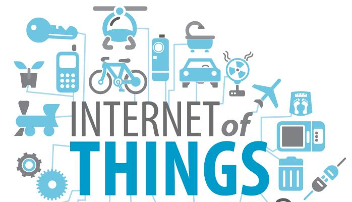

Internet of Things - IoT, has become the latest catch word in the industry and among the common population who knows something about the gadget world.

I have been following this stream of industry for over 6 months now. One of the mains reasons for this is  - I am a Node.js and JavaScript developer.

This article is about my thoughts on where we might and we will see IoT.

1.  We will have home vigilance cost 20 times cheaper than what it is today in 2016 using Node.js with simple messaging services like MQTT running on our smart phones.
2.  We will see our home appliances like Refrigerator, washing machine, geysers talk to us through our smart phones and our smart phones automatically controlling them based on our previous actions and Artificial Intelligence.
3.  We already are seeing ACs and car companies talking about IoT. Yet, there is a long road ahead before our cars are truly automated. 

  

*IoT*

Car automation for me means

-   Car talking to us about the air in its tyres and when to fill it.
-   Car talking to us if there is a flat tyre.
-   Car calculating its milage and updating its statistics into an app installed in our smart phone that is connected using bluetooth.
-   Car talking to the service stations about the upcoming services
-   Updating the car health card about different parts of it to an app in our smart phones.

  

  
  I also like to see smart phones controlling the room ambience and other atmospheric parameters in our rooms.

I also see that IoT will help us monitor our kid when we go to a washroom or to kitchen and help us if they feel lonely or scared and alert us using the Facial Artificial Intelligence Open Source projects.

Have any thoughts or comments? Write it down here. I love hearing from you!  
Image courtesy: http://sakrobotix.com/

\-Eshwar Prasad Yaddanapudi
