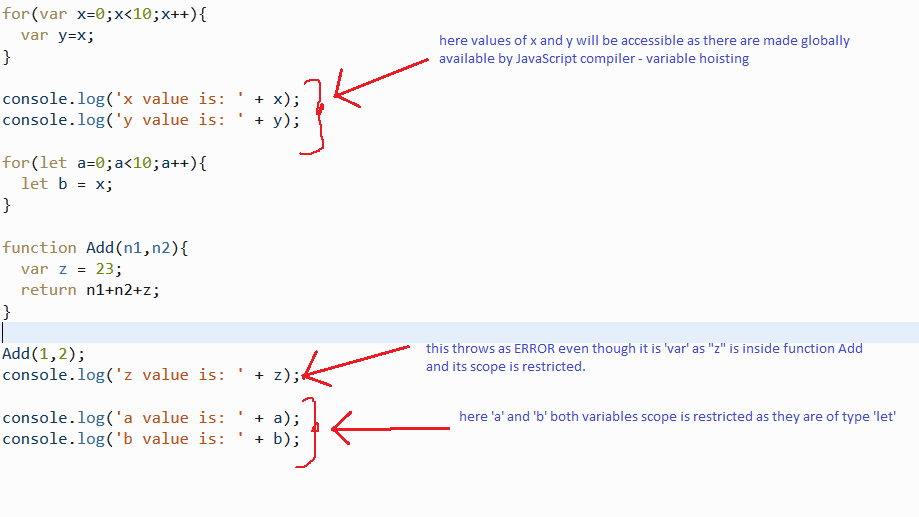

Scope is an important aspect in programming. This scope concept is quite different and challenging in JavaScript. This is more in case of variables because of the variable hosting concept.

Keyword - 'var' makes variables available at global if its not bound inside a function and when inside a function, it is available as a scope variable all throughout that function.

On the other hand, 'let' keyword restricts the variable similar to how the scope of variables in with C# or Java. This brings in the most needed advantage and functionality that has been making developers get nightmares for because of variable hoisting.  

