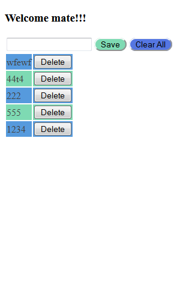

Hi All,  
As promised yesterday, i have uploaded the code to the git hub and it can be found here.  
This is mobile first application designed using media queries + css3. I will let you know, once i convert this file to a mobile app. I am thinking to use PhoneGap for this. I have to get hands on and then do this. so will take some time. I have used the localstorage of the web browser to store the data as a json. See you tomorrow with Agile.

link for source code: [https://github.com/eshwaryaddanapudi/MagicTodoList.git](https://github.com/eshwaryaddanapudi/MagicTodoList.git)

 

(img: all rights to the owner) 

  

 (mobile phone screenshot)

 

(desktop -web browser screenshot)
