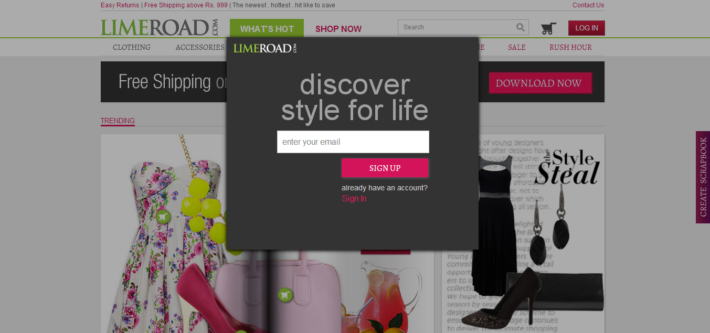

In this new world of technology, where eCommerce is making the established shop sellers sweat, one of the ways where you show growth is by the number of people registered with your site. 

But is it good to have a forced signup page as the landing page? 

Many people from famous sites like Smashing Magazine, Design Moto etc., say that let the customer experience the site first and make her love your way and then let her decide when to become a logged in customer. Sure, she will become when she wants to end up buying an item from you.

  

  

(note: This is not to critisize any website owners and handlers, they are purely opinion and debate based. Feel free to contact me if any of the content is objectionable for you)
