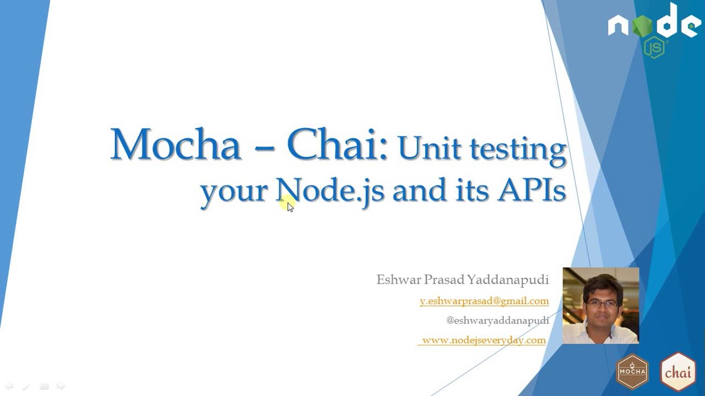

Mocha.js and Chai.js together are a great tool to write unit test cases for your nodejs applications. So here is the Video series on how to use Mochajs and Chaijs in Nodejs.  
  
Introduction : Overview of the Web telecast series  
  
  

  

