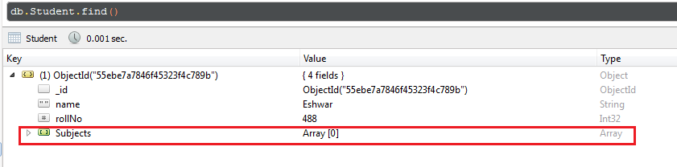
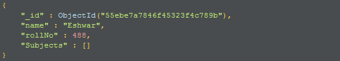
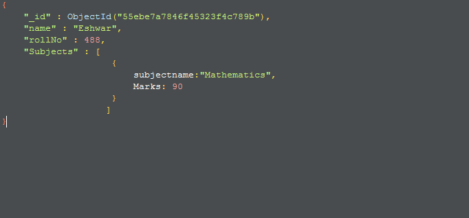
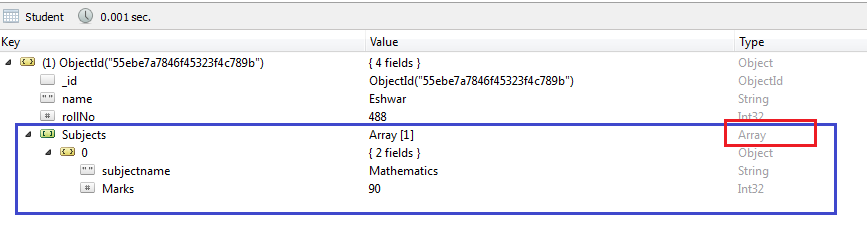

We recently had a requirement where were required to update an array inside the document. Array is a filed inside my document apart from few simple datatypes.  


  
Here is the current document structure



  

  



  

I want to add a JSON to this ARRAY field as shown below.



  

Once added, the document looks like this



This is how we do it in the code. There are many ways apart from this yet, I found this more readable and more easy to use.

```js
postRouter.post('/updateSubjectForStudent',function(req,res){
	var query = {'Id': receivedData.Id};
	var doc = {
				$set:{
					'modifiedAt': Date.now()  // this is to set data for straight fields
				},	
				$push:{ // this is the operator that we need to use to set data for the array
					Subjects: { //  is the field name of the array for which we need to add a new JSON
						subjectname: receivedData.SubjectValue,
						marks: receievedData.marks
					}
				}
	};
	var options = {upsert:true};
	Students.findOneAndUpdate(query,doc,options, function(err){
		if(err){
			return err;
		}else{	
			return 'success update';
		}
	})
})
```
