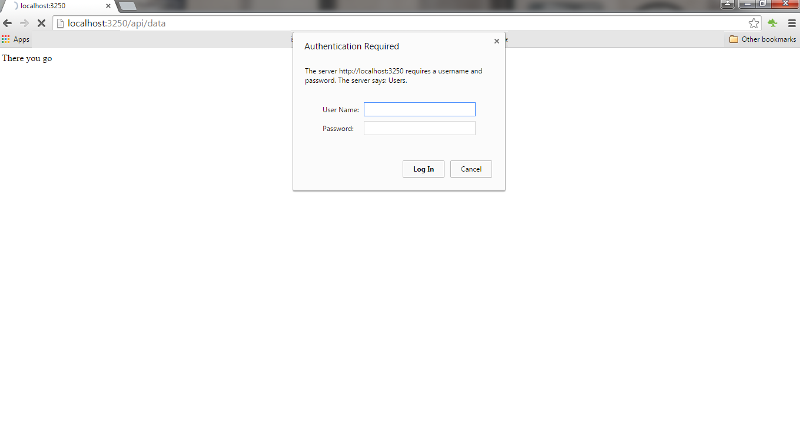
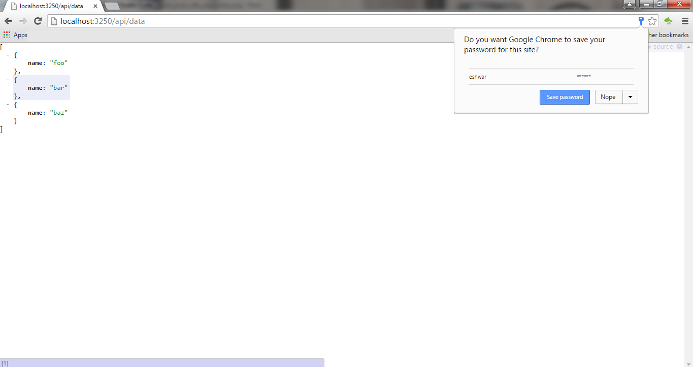
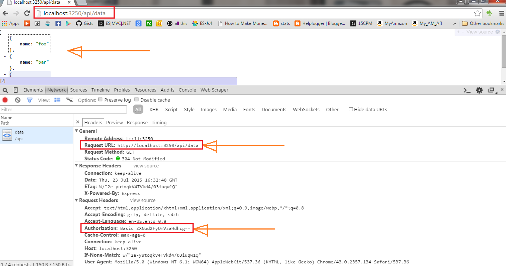

## Nodejs REST API Authentication using Passport.js 

Hi All, I know its been a while that I have written an article here. However, I have not waster a single day. I was into writing concepts on JavaScript Module pattern and JavaScript Prototype Pattern.   
  
I will soon put up all the content explaining JavaScript Prototype pattern and Prototype by default in great detail here.  
Coming back to the current article, Nodejs , the serverside JavaScript framework is famous for writing REST APIs. It is also famous for writing webapps (web pages) using ejs/ jade/hapi etc as the web frameworks.  
  
In this article, I will help you out writing an API in node and authenticating it using passportjs.org's passport-http basicStrategy method. In real world scenarios, it is advised to use SSL to implement authentication.   
  
So, lets jump into the code an build an API.  
  
1. do the below three npm first in your project.

-   npm express 
-   npm passport
-   npm passport-http.

  
2\. Now, define the require statements.  

```js
var express = require('express');
var passport = require('passport');
var passportHttp = require('passport-http');
```

  
3\. define a port where the API is exposed for use and the app listens to.  
  
4\. Let the app know that it has to use passport.  

```js
var basicStrategy = passportHttp.BasicStrategy;

var app = express();

app.get('/',function(req,res){
	res.send("There you go");
});

app.use(passport.initialize());
```

5\. Initialize the passport  
6\. Define the BasicStrategy via the passport-http.  
7\. Let passport know that it has to use BasicStrategy to do the authentication  
8\. As per the documentation, BasicStrategy  takes three arguments. They are the input username, password and a callback named 'done'.  

```js
passport.use(new passportHttp.BasicStrategy(function(username,password,done){
	if(username === password){
		done(null,username);
	}else{
		return done(null,'there is no entry for you!');
	}
}));

function ensureAuthenticated(req,res,next){
	if(req.isAuthenticated()){
		next();
	}else{
		res.sendStatus(403);
	}
};
```

9\. 'done' lets the passport know if there was a success or a failure during the authentication.  
10\. Based on the result of the authentication, that is injected to the express framework via app that uses this passport to allow the user to the next level of query using the next() call of the express.  
11\. For http, because the APIs are session less, the session is false in the code.  
12\. In our example, we return true when username and password are same. However, in real world example, the username and password are to be cross verified against your database user table details.  
13\. In our example, once the user is authenticated, we display some static data. In real world, it is some data from database.  
Complete code is below. You can also look at the [complete code here.](https://gist.github.com/04e93d7f2733485ae097.git)  

```js
app.use('/api',passport.authenticate('basic',{session:false}));

app.get('/api/data',ensureAuthenticated,function(req,res){
	var somevalue = [{name: 'foo'},
		{name: 'bar'},
		{name: 'baz'}];
		res.send(somevalue);
});

app.listen(3250);
console.log('listening to port on ' + 3250);
```

  
  

```js
// complete code for the exmaple node rest api authentication using passport
var express = require('express');
var passport = require('passport');
var passportHttp = require('passport-http');
var basicStrategy = passportHttp.BasicStrategy; // using the basic authentication

var app = express();

app.get('/',function(req,res){
	res.send("There you go");
});

app.use(passport.initialize()); // initialize and use it in express

passport.use(new passportHttp.BasicStrategy(function(username,password,done){
	if(username === password){
		done(null,username); //null means no error and return is the username here.
	}else{
		return done(null,'there is no entry for you!'); // null means nothing to say,
		//no error. 2nd is the custom statement business rule
	}
}));
// this function hits first when there is an API call. 
function ensureAuthenticated(req,res,next){
	if(req.isAuthenticated()){
		next(); 
		// next redirects the user to the next api function waiting to be executed in the express framework
	}else{
		res.sendStatus(403); //forbidden || unauthorized
	}
};
// this means all the API calls that hit via mydomain.com/api/ uses this authentication.
//session is false, because its a HTTP API call.
// setting this helps passport to skip the check if its an API call or a session web call
app.use('/api',passport.authenticate('basic',{session:false})); 
// this is served the user once the authentication is a susccess
app.get('/api/data',ensureAuthenticated,function(req,res){
	var somevalue = [{name: 'foo'},
		{name: 'bar'},
		{name: 'baz'}];
		res.send(somevalue);
});

app.listen(3250);
console.log('listening to port on ' + 3250);
```

So there you go, below are the screenshots when i run the application. Hope this helps. I will soon upload the application to github. Thank you so much. See you soon with more JavaScript, C# and Node.js code samples and code snippets.  

  

  

  

  






