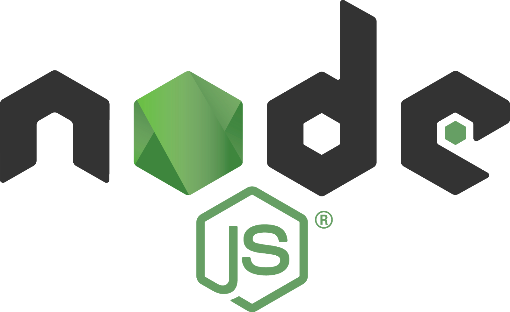

Using postman app for chrome, i was trying to post to my node js application listening to port 3001.  
however, all the body of the data is sent as empty.  
Because of this, the only data that is getting saved in mongodb using the mongoose connection was as below:  
  
{  

```
    "_id": "542e4ea1480f9abc13239976",
    "__v": 0
}
```

```
The issue with the code was that the body parser was placed at the end after the mongo connection was created and just above the app.listen(3001) line
```

```
When i changed the code to the top of the file just after the line
```

```js
var app = express();
```

it worked for me.

  



*www.nodejseveryday.com*

  

now my complete code looks like this

  

  

var express = require('express');

mongoose = require('mongoose');

fs = require('fs');

  

var app = express();

  

app.configure(function () {

    app.use(express.logger('dev'));     /\* 'default', 'short', 'tiny', 'dev' \*/

    app.use(express.bodyParser());

});

  

  

var mongoUri =  'mongodb://localhost/MyTestDatabase';

mongoose.connect(mongoUri);

  

var db = mongoose.connection;

  

db.on('error',function(){

throw new Error('unable to connect to db');

});

  

  

  

require('./models/MyTestModle');

require('./routes')(app);

  

//moved from here to the yellow highlighted section

  

app.listen(3002);

console.log('Listening on port 3002...');
