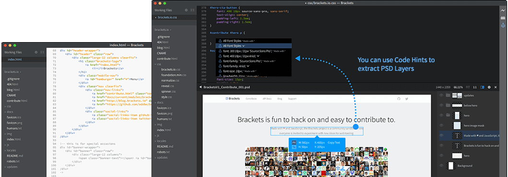

Ever wondered how easy it would have been as a developer to have something that previews your HTML code changes instantly?  
Feels good, isn't it? Here is the answer to all those wonderful feeling - Its [Brackets.io](http://brackets.io/)

Get a real-time connection to your browser. Make changes to CSS and HTML and you'll instantly see those changes on screen. Also see where your CSS selector is being applied in the browser by simply putting your cursor on it. It's the power of a code editor with the convenience of in-browser dev tools.

This is just an information article. I have tried using the editor and looks awesome and fabulous.  

