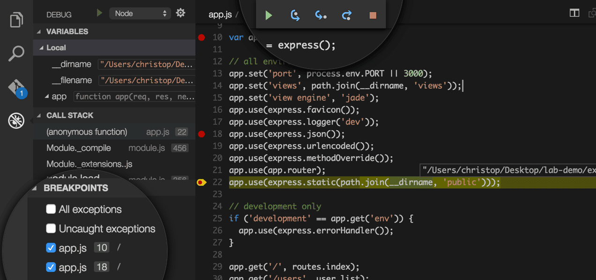

Visual Studio from Microsoft is mostly used as a paid one except for small application and demos that are done by people like us. For quick code snippets and tutorials, Visual Studio Express has been released a along with VS2010. From then on, Microsoft has been having an eye on the trends and developments in the market.  
They have released plugins via their NuGet package manager for Node.js, CofeeScript and many others in the last few months.  
After Satya Nadella became its CEO, Microsoft has predominantly been embracing open source communities. Their MVP now includes open source contributions as well.  
They have recently released VS-Code editor that fits rightly for a right looking IDE for Node.js. Its light wait and installs quickly. It is a perfect one to develop ASP.NET with Node.js.
