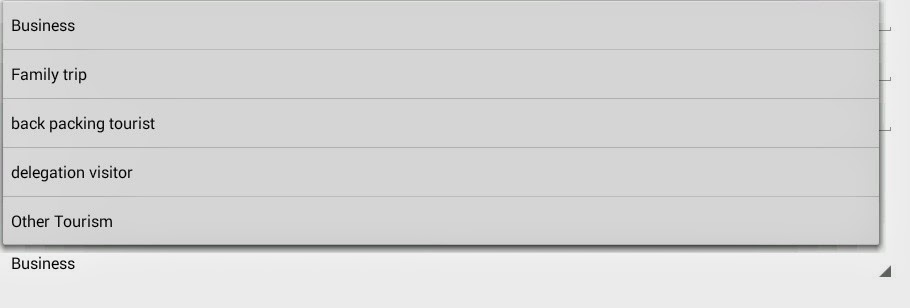

These days, as part of my side project, I have started working with Android. There was a requirement to show type of travel (business, economy, tourist, etc.,) basis for the customer who is awaiting to check-in into our clients hotel.

Android gives us a simple spinner item that can be quickly built and used. Below is the sample. For the sake of the sample, i have hard coded the location names, instead of picking up from SQLlite.

for my MainActivity.xml, i have made it implement  AdapterView.OnItemSelectedListener .

Then, defined the spinner and its dataset  
        //to read the spinner element  
        Spinner spinner =(Spinner) findViewById(R.id.spinner);  
        spinner.setOnItemSelectedListener(this);  
        // Spinner Drop down elements  
        List<String> categories = new ArrayList<String>();  
        categories.add("Business");  
        categories.add("Family trip");  
        categories.add("back packing tourist");  
        categories.add("delegation visitor");  
        categories.add("Other Tourism ");

Then, i have set the Adaptor details for the ArrayList and the spinner to bind together.

// Creating adapter for spinner  
        ArrayAdapter<String> dataAdapter = new ArrayAdapter<String>  
                                    (this, android.R.layout.simple\_spinner\_item, categories);  
  
       // Drop down layout style  
       dataAdapter.setDropDownViewResource(android.R.layout.simple\_spinner\_dropdown\_item);  
  
   // attaching data adapter to spinner  
       spinner.setAdapter(dataAdapter);

Override the methods for onItemSelected

 @Override  
    public void onItemSelected(AdapterView<?> adapterView, View view, int position, long id) {  
        // On selecting a spinner item  
        String item = adapterView.getItemAtPosition(position).toString();  
  
        // Showing selected spinner item  
        Toast.makeText(adapterView.getContext(), "Selected: " + item, Toast.LENGTH\_LONG).show();  
    }  
  
    @Override  
    public void onNothingSelected(AdapterView<?> adapterView) {  
  
    }  

here is the out come of the code in the emulator.

  

  

