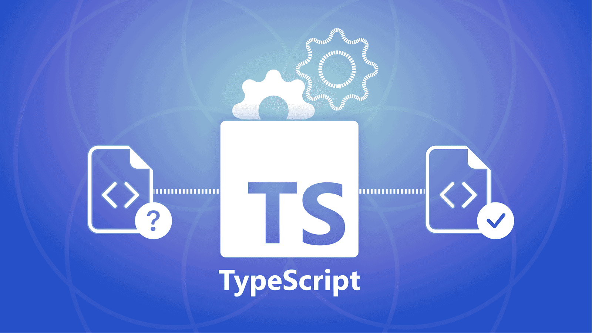

Recently, I am trying to build a Domain Specific Language (DSL) which sits inside a TypeScript file (\*.ts).

My aim is to read and convert this file into a JSON and then convert it into to JavaScript and then to XML.

To do this, we need to traverse the code inside this .ts file which has the DSL. This can be done either directly by TypeScript Compiler API which is more verbose and laborious or through a package called ts-morph which wraps the APIs into a more convenient interface.

I chose ts-morph for my use case.

Here is a sample code from my DSL. It assigns a constant with a function call that takes a plain JavaScript object.

```ts
export const server_script = ServerScript({
  name: 'script',
  metadata: {
    origin: 'external_api',
    module: 'customer',
    createdBy: 'Admin'
  }
});
```

To parse this, when we send the file to ts-morph, it creates an AST (Abstract Syntax Tree) which needs to be recursively parsed to extract the required information.

If we use the ASTExplorer tool, we will see a tree as below:

```text
SourceFile
  └─ VariableStatement
       └─ VariableDeclarationList
            └─ VariableDeclaration (name: "server_script")
                 └─ Initializer → CallExpression
                      ├─ Expression → Identifier ("ServerScript")
                      └─ Arguments
                           └─ ObjectLiteralExpression
                                ├─ PropertyAssignment (key: "name")
                                │   └─ Initializer → StringLiteral ("script")
                                └─ PropertyAssignment (key: "metadata")
                                     └─ Initializer → ObjectLiteralExpression
                                          ├─ PropertyAssignment (key: "origin", value: "external_api")
                                          ├─ PropertyAssignment (key: "module", value: "customer")
                                          └─ PropertyAssignment (key: "createdBy", value: "Admin")
```

As we can notice, the object’s key–value pairs such as **Key: name** and **Value: script** can be extracted differently. Let’s see how.

We have to let the TypeScript compiler know that the node we are parsing is of type `Node.ObjectLiteralExpression`.

Here’s the step-by-step extraction process. First, we find all nodes which are of `ServerScript` type:

```ts
const scriptExpressions = sourceFile
  .getDescendantsOfKind(SyntaxKind.CallExpression)
  .filter(call => call.getExpression().getText() === 'ServerScript');
```

The result we get is of type `CallExpression<ts.CallExpression>[]`, which is essentially nothing but an array.

we need to now iterate through the above CallExpression array. for now let us take we loop through the first element in the array. the code looks like below

```ts
const ObjectLit = callExpr.getArguments()[0].asKindOrThrow(SyntaxKind.ObjectLiteralExpression);
const currentProps = ObjectLit.getProperties();
```

```ts
currentProps.forEach((attribute: ObjectLiteralElementLike) => {
  const currAttribute = attribute.asKindOrThrow(SyntaxKind.PropertyAssignment);
  const key = currAttribute.getName();
  
});
```

as we can see above, the Key is easy to read - it is a simple `.getName` but to read the value we need to do `.getInitializer()` first to read the complete value and then check its type and then read the value, for example in our case it is a simple `StringLiteral` as seen above, it is `currAttribute.getInitializer()?.getText()`

but then why does ts-morph wants us to do this extra job to read the value and not a simple `.getValue()`??

This is because, the value here can be another ObjectLiteral or a CallExpression or anything. Thus the compiler wants us to explicitly understand what it is and hence gives us the option *.getInitializer()* to first get it and check its type and then extract the content.

ts-morph is an npm package that wraps the TypeScript compiler API to make syntax tree manipulations much simpler to perform using TypeScript itself.


