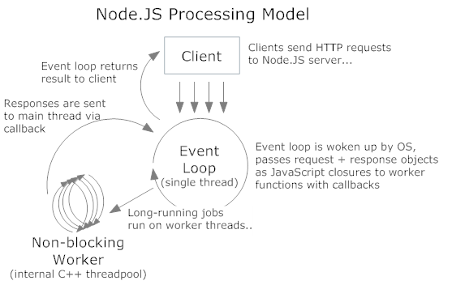

## Ultimate Node.js Beginner Tutorial - Introduction

I know you would have read a lot of blogs / articles and pages on internet and watched hours of Node.j sessions on YouTube and coursera. You might have landed on this page praying that at least this page should do some justice to your relentless and tiring search for a better article. 

  

If the above statements are true, even to a certain extent then trust me, you are at the right place. In the series of articles on my blog, I will make sure you leave from here with stomach full of knowledge on Node.js and your nerves full of enthusiasm and your heart full of belief and your neurons full of excitement to develop the next Node.js application. 

  

Let’s jump right away on the task. We have a big task ahead and no time should be wasted.  
  
  

  
Here is the Video for you guys. There is more in it on top of the content that is in this post. Listen to it, subscribe and share.  

  
  

### **Building REST API using Node.js** 

#### Question: What is Node.js?

**Answer:**

·         I know it might be boring to read again and so I will keep it plain and simple.

·         Node.js is a framework that makes us JavaScript run on server.

·         It is built on top of Google Chrome’s V8 engine which is the fastest JavaScript engine till date.

·         Node.js is single threaded.

·         Node.js helps us do Asynchronous I/O operations.

·         Node.js does I/O operations that are non-blocking.

·         Node.js helps us build not just websites but also REST APIs that are easy to design and are faster than web services or WCF services.

  

#### Question: How Node.js is fast if it is single Threaded and how does it do non-blocking Asynchronous I/O operations?

**Answer:** Ahh.!!! I can see the expression on your face. Spot On! That’s what I said, right.

Node.js under the hood takes help of the C++ libraries called as libev and libuv and libeio to make this work.

Libuv is the module from C++ that makes Node.js do all the talking in Asynchronous I/O operations.

  

Below is the picture to help you understand better.

  

#### Question: Then what about the non-blocking aspect?

**Answer:** As you know JavaScript engine has the event loop that takes care of waiting functions and processes. It is the same thing that is used here. Because that is from V8 engine, it is faster than anything else.

  

To understand better, here is the picture of the same

  

