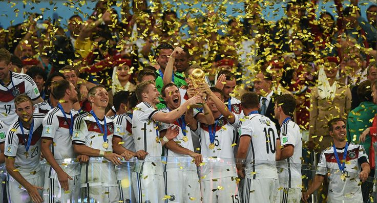

Ahaaa....!!! The world has just witnessed an exemplary tournament. The FIFA 2014 world cup has just ended in Brasil. Firstly, Thank you Brasil for making it go in such a great and smooth manner. Moving on lets congratulate Germany for winning the Cup for the 4th time and Argentina for making it to the finals after 24 years.  
After witnessing a great performance and supporting the great teams in this tournament, we should not leave as is. Every team has taught us so much on how to perform, how to over come and how to build and deliver in demanding situations. However, the most learning's are taken from the team that makes to the top.  
**So, what exactly has the German team taught us?**  

**1\. Strong understanding of vision.**  
After tasting their lowest in performance, Germany has revamped their thoughts and have come up with a clear vision. A vision that defines not just their target but their weaknesses and how they will have to work on them and come out of it stronger.  
**2\. Common goal.**  
If Vision is only of the coach, it will never be realized. It is a vision of a few it will never be full. It can of Germany, the vision was seeded in everyone's soul and not just in their timelines.  
**3\. Continuous Innovation.**  
Defining a Vision doesn't help anything but wasting time and thoughts. What Germany did in the last 10-15 years was setting up camps every where in their country and nurturing talent and bringing the best from every part of the Deutsche land. Every time a team won, they took notes of the good and the better from that teams, even if they are the smallest teams.  
4\. Staying focused and working hard.  
More important than finding talent is to tune them to stay focused and working hard to stay fit and deliver to the situation.  
**5\. Staying Flexible.**  
There were no fixed places in the team's play and formations. Though they followed the standard patterns and put them up on the charts before the match, the members were quick to take decisions based on the situation. Thus they played for the game than playing for a format.  
  
**6\. Executing as a team and execute in excellence.**  
Unlike many other teams, Germany was always been seen as a players in the team than players for the team. It was not like Messi for Argentina, Neymer for Brasil or Robben for Netherlands. Every time and in every match there was a new name who scored the goal. Even Klose and Muller were always been members of the team than super stars running the team. Thus everyone could play every other person's role. This meant that the team is never deprived of quality of service from its men. This made sure that Germany delivered it in excellence almost always.
