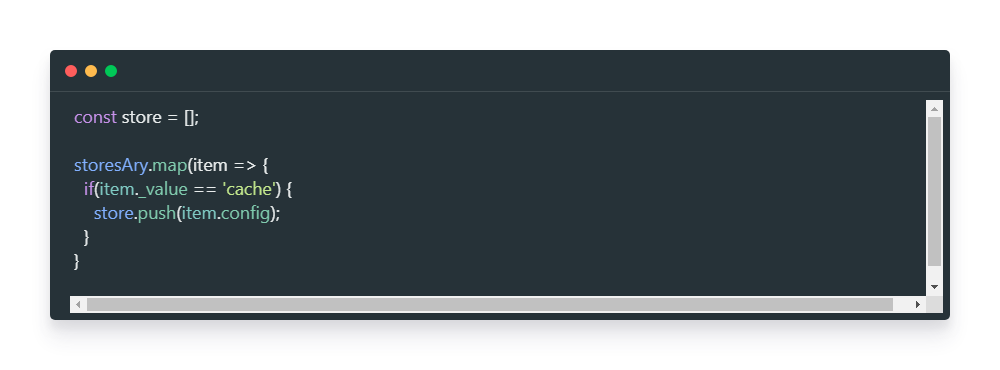
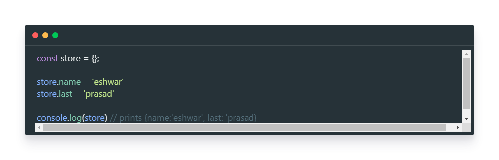

So, recently, I was doing a code review and found a piece of code which is like below

As you can see in the above code, The empty array that is defined as const is mutable. This is because - the constant constraint is enforced only on the variable type and not inside it.

This is the same with objects as well. You can see the example below

