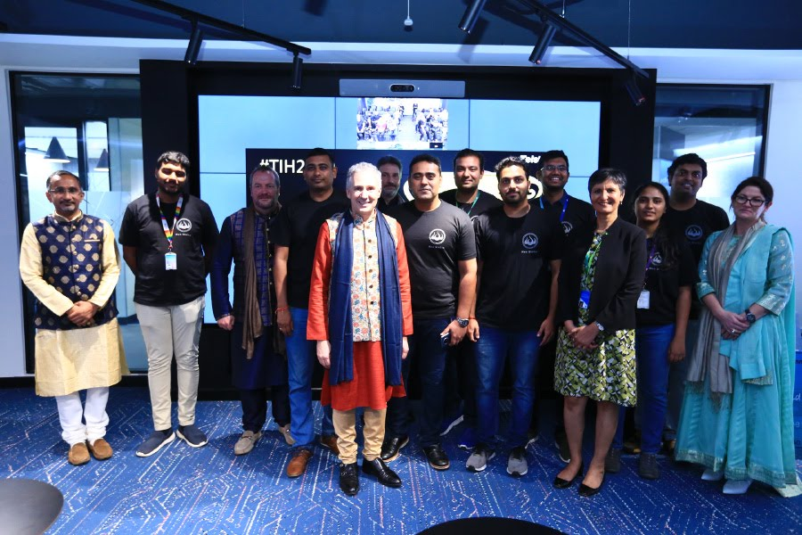
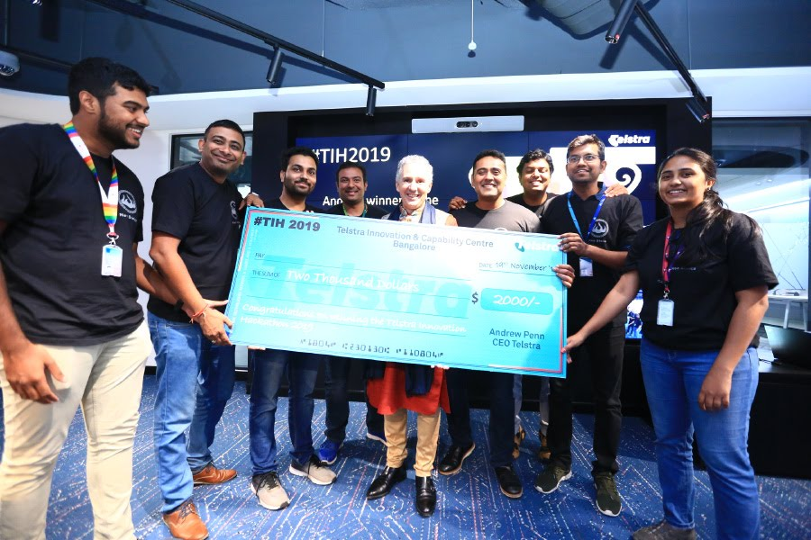
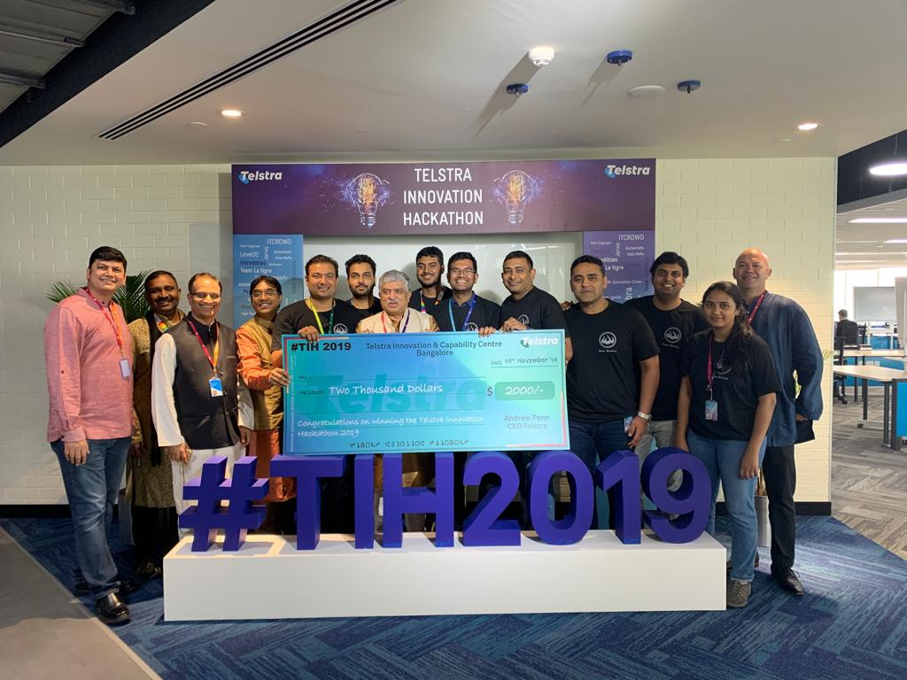
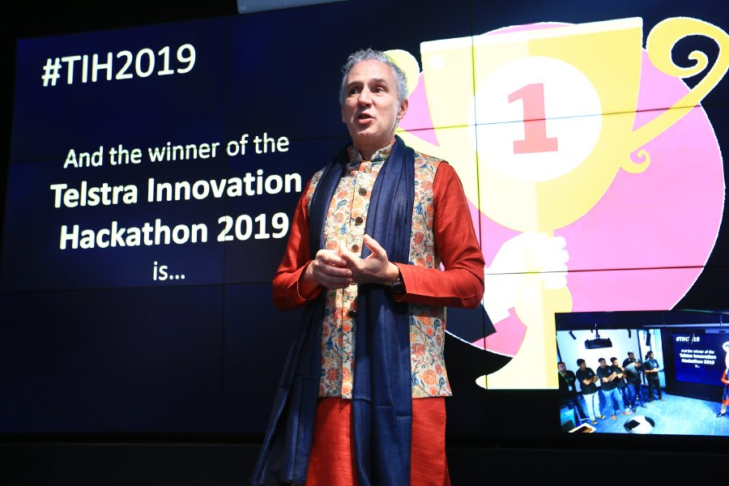
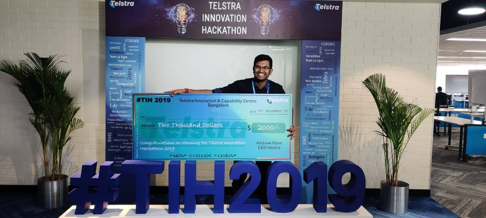

6 rounds, 69 teams and 350+ participants and spread over 4 weeks of action packed Hackathon event. Teams from Telstra, Infosys, Amazon, Cognizant, Accenture and Wipro participated in Telstra innovation Hackathon - 2019, an event at Global scale. 

My team has brought the best out of them again to Win the first prize in a tightly contested last 2 rounds.

It was a pleasure to stand before the Global Senior Leadership team of Telstra and receive the award from the most well known names of the Globe. 

  

(In Alphabetical Order)

[Andy Penn](https://www.linkedin.com/in/andrew-penn-48707219/) - CEO of Telstra Corporation.

[Alex Bedanoch](https://www.linkedin.com/in/alex-badenoch/) - Group Executive, Transformation and People

[Arun Kumar N.T](https://www.linkedin.com/in/ntarunkumar/) - Head India Innovation Center, Telstra.

[David Burns](https://www.linkedin.com/in/david-burns-50360b4/) - Group Executive, Global Business Services

[Her Highness Shri Harinder Sidhu](https://powermin.nic.in/en/content/australian-high-commissioner-india-ms-harinder-sidhu-meeting-minister-state-power-coal-new) - Australian Ambassador to India.

[Nandan Nilekhani](https://www.infosys.com/about/management-profiles/nandan-nilekani.html) - Co-Founder, Chairman of Infosys Limited, Father of Aadhaar Card.

[Pravin Rao](https://www.infosys.com/about/management-profiles/pravin-rao.html) - COO of Infosys Limited.

  

  

  

  

  

  

A heart felt thanks to all my colleagues and teammates for the amazing team work and collaboration. 

Heartfelt gratitude to Global Leadership team and India Senior Leadership team for the amazing encouragement and recognition.
